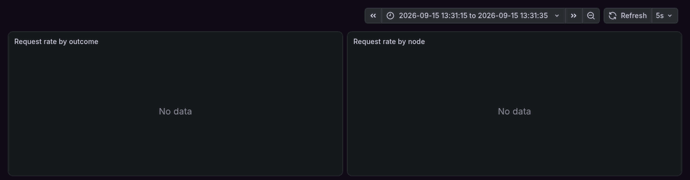
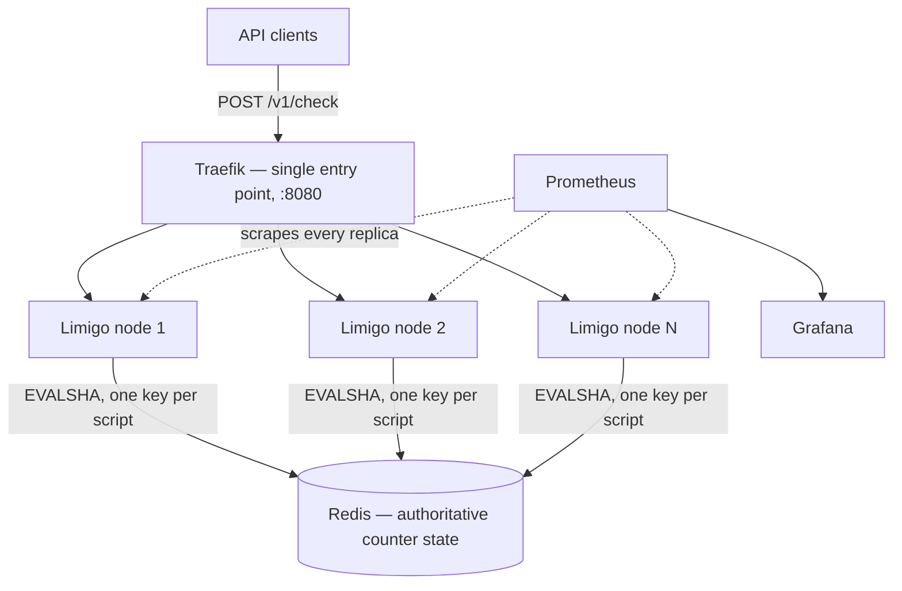
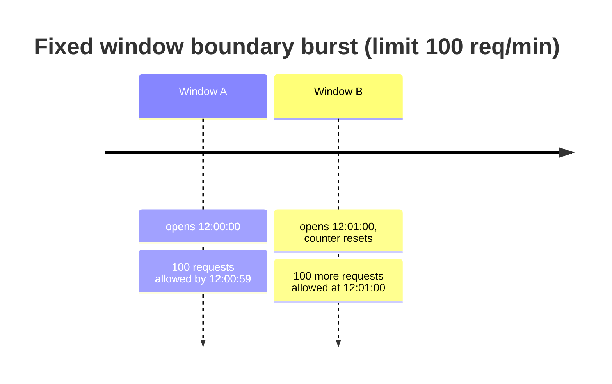
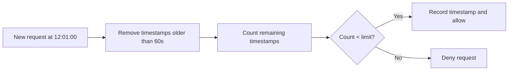
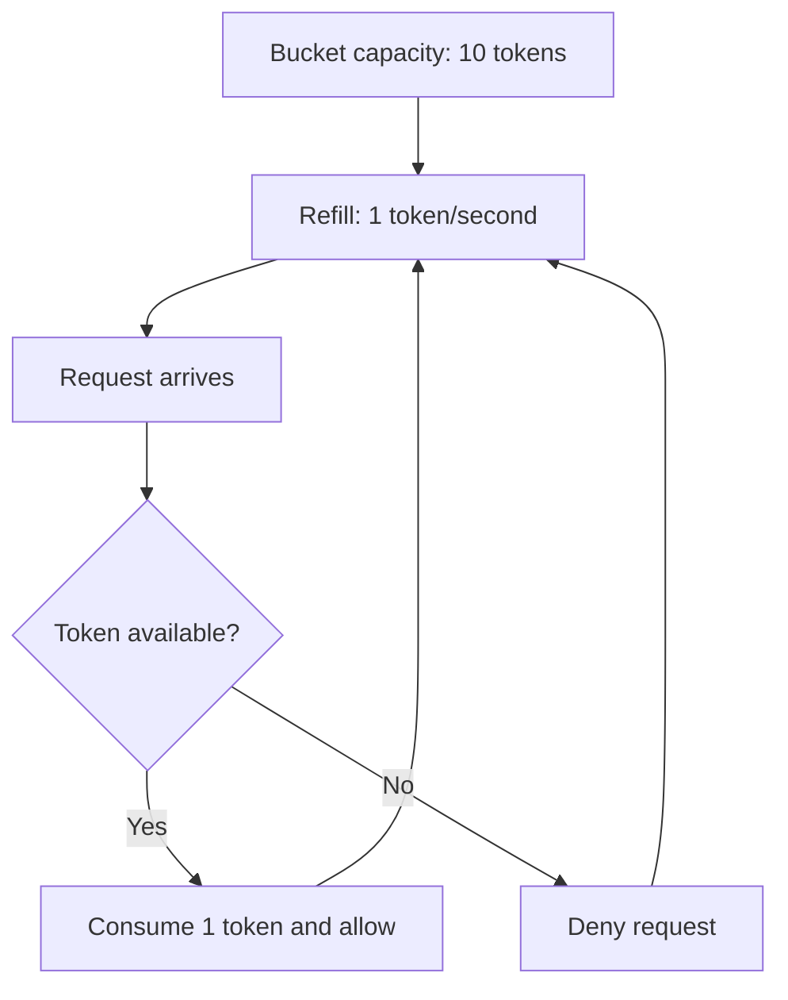
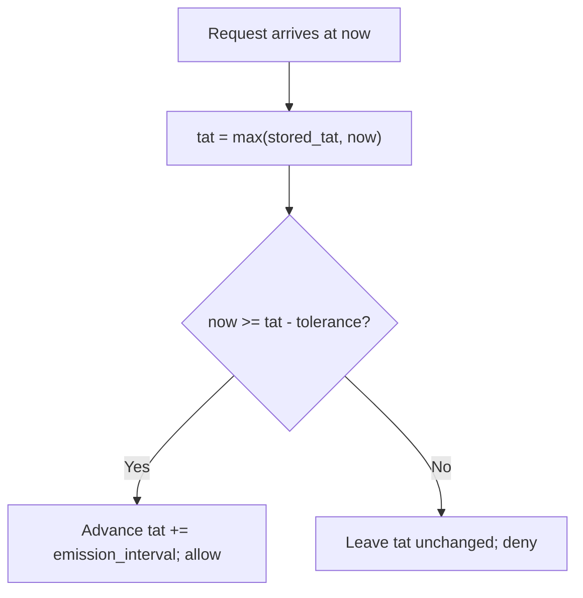
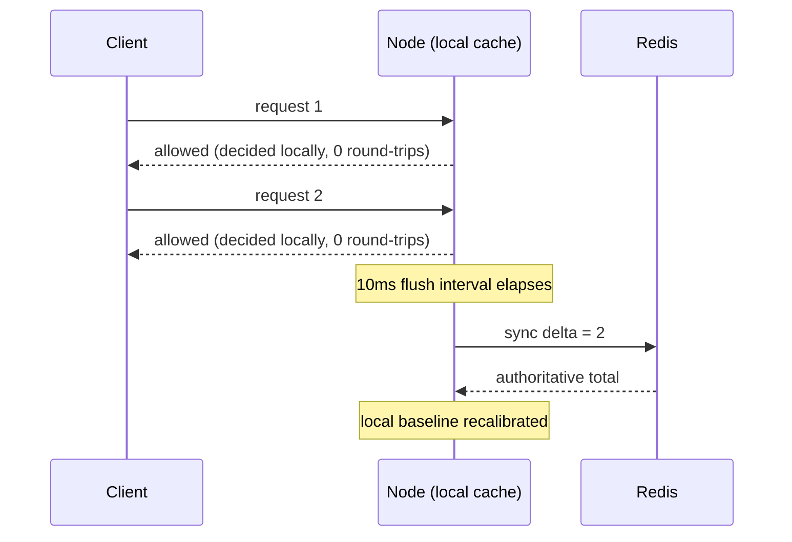

# Limigo

[](https://github.com/HweyTH/limigo/actions/workflows/ci.yml)
[](https://go.dev)
[](https://redis.io)
[](https://www.lua.org)
[](https://traefik.io)
[](https://prometheus.io)
[](https://grafana.com)
[](https://docs.docker.com/compose/)
[](LICENSE)

A distributed rate limiter in Go. Counter state is shared across nodes in Redis
and every decision runs as an atomic Lua script, so adding nodes never
double-spends a client's quota. Four algorithms, hot-reloadable rules, and a
published measurement of exactly what the accuracy/latency trade-off costs.

## Demo: one node, then three



300 req/s offered to `burst-tier-token-bucket` (refill 200/s, capacity 1000),
first against one node, then against three. **Allowed stays at 200/s in both
phases** — the excess is denied, not double-spent — while the per-node panel
splits from one line into three. Each phase opens with the same ~10 s burst of
extra admits: that is the bucket's capacity being spent, and it happens once
per full bucket, not once per node.

Reproduce it with `bench/run-demo.sh`. It needs only docker: it brings the
stack up, runs both phases, and leaves everything running so you can watch
[Grafana](http://localhost:3000/d/limigo) yourself.

## Why distributed rate limiting is hard

On one machine, a rate limiter is a counter behind a mutex. The difficulty
starts when there is more than one machine.

**Race conditions.** Read the counter, compare, write it back: a
read-modify-write with a gap in the middle. Two nodes serving the same client
both read `99`, both admit, both write `100`. The limit is breached and neither
node did anything wrong. Limigo never issues a `GET` followed by a `SET`. Each
algorithm's whole decision is a Lua script under
[`internal/store/lua/`](internal/store/lua/), and Redis runs it atomically, so
the check and the increment cannot interleave. Each script touches exactly one
key, which is also what makes it run unmodified on Redis Cluster — see
[Single-key Lua scripts](#single-key-lua-scripts-deliberately-no-hash-tags).

**Clock skew.** Window boundaries, bucket refills and GCRA schedules all need a
clock, and separate machines disagree about the time. A node running a second
fast admits traffic its peers would deny. Limigo's scripts never accept a
timestamp from the caller; they call `redis.call('TIME')`. There is one clock
in the system, so there is no skew to reconcile. (Calling `TIME` and then
writing sets a Redis version floor; see
[Single-key Lua scripts](#single-key-lua-scripts-deliberately-no-hash-tags).)

**Redis failover.** The shared state is a shared dependency. When Redis is
unreachable, a limiter must either admit traffic it cannot meter or deny
traffic it cannot justify denying. Limigo **fails closed**: `/v1/check`
returns `503` with `allowed: false`, and the error is counted separately from
a denial so a dashboard never confuses the two. That protects the quota at the
cost of availability, which is right for some deployments and not others. The
reasoning, the counter-position, and the condition under which the opposite
choice is correct are in [Fail closed](#fail-closed-when-the-store-is-unreachable);
`bench/run-outage.sh` measures what a node actually does across a Redis kill
and restart.

## Architecture

Limigo nodes are stateless and interchangeable. All shared counter state lives
in Redis, so a dead node loses nothing that matters. That is what makes
`docker compose up --scale limigo=3` one limiter rather than three that
disagree.



Rules match in configuration order, first match wins. When the config file
changes on disk the whole rule set is recompiled and swapped atomically — no
restart, no dropped requests.

Each node exposes two health endpoints with different jobs. `GET /healthz` is
**liveness** — a static 200 that touches nothing, which is also what makes it
the control endpoint every benchmark's ceiling is measured against. `GET
/readyz` is **readiness**: 200 while the node will take new work, 503 from the
moment shutdown begins. On `SIGTERM` a node fails `/readyz` first, keeps
serving for `-drain-delay` so Traefik's next health check routes new requests
to its peers, and only then closes its listener and drains what is in flight.
Readiness deliberately does not probe Redis: a store outage already shows as
fail-closed 503s per rule, and failing readiness on it too would pull every
node out of the pool at once with less to show for it.

## Rate limiting algorithms

Four algorithms behind one interface, each with a different trade-off between
fairness, burst handling, memory and implementation cost.

| Algorithm | Accuracy | Burst behaviour | State per key | `local_cache` | Exact `Retry-After` |
|---|---|---|---|---|---|
| **Fixed window counter** | Approximate — boundary bursts | Up to 2× the limit across a window edge | One integer | Supported | No |
| **Sliding window log** | Exact over the rolling window | None | One timestamp per request in the window | Rejected at config validation | No |
| **Token bucket** | Exact average rate | Up to the bucket's capacity | Two fields: tokens, last refill | Supported | No |
| **Leaky bucket (GCRA)** | Exact schedule | Configurable tolerance via `burst` | One timestamp (the TAT) | Rejected at config validation | Yes — millisecond precision |

The last two columns describe *this* implementation, and both are enforced in
code: config validation rejects `local_cache` for the two algorithms it would
undermine, and only GCRA can compute the exact moment a denied client becomes
admissible. Both are explained below.

### 1. Fixed window counter

Count requests in a fixed window; reset when the next window starts.

Example: a free plan allows 100 requests per minute. A user sends 100 requests
at 12:00:59 and 100 more at 12:01:00. Both batches pass, because they land in
different windows — 200 requests in about one second.



Where it fails: put that limit in front of a checkout or payment API. A client
spends its quota just before the reset and the next minute's quota just after.
The counter is correct in both windows, but the payment service still takes
200 near-simultaneous requests: exhausted worker pools, lock contention,
retries piling up.

Limigo keeps fixed window as the simplest baseline and to make this weakness
visible. For production traffic, sliding window gives stricter fairness and
token bucket gives controlled bursts at a steady average rate.

### 2. Sliding window log

Look back over the last rolling period instead of resetting at a boundary.
Limigo records request timestamps and drops entries older than the window.

Example: limit 100 per minute. A request at 12:01:00 checks 12:00:00 to
12:01:00. If the user already sent 100 requests in that rolling minute, the
request is denied even though the wall-clock minute changed.



Why use it: no boundary burst, exact accuracy. The cost is memory — one
timestamp per recent request.

### 3. Token bucket

Control the average rate while allowing short bursts. The bucket refills over
time up to a capacity; each allowed request consumes one token.

Example: 10 tokens, refilling at 1 token per second. An idle user's bucket
fills back up, so they can send a burst of 10, then they are held to the
refill rate.



Why use it: short bursts are fine but sustained traffic must stay within a
steady rate. A good fit for user-facing APIs, where a spike should not punish
a well-behaved client.

### 4. Leaky bucket (GCRA)

Admit requests on a steady schedule instead of banking a burst. Limigo
implements it as **GCRA** (Generic Cell Rate Algorithm), the form Stripe's
limiter and Redis's `redis-cell` module use. It tracks one value per key: the
Theoretical Arrival Time (TAT), the earliest moment the next request is due
under perfectly smooth spacing. A request is admitted if it arrives no earlier
than a configured tolerance before its TAT. Admitting advances the TAT by one
emission interval (`window / limit`); a denial leaves the schedule untouched.

Example: a payment processor sustains 10 requests/second and gains nothing
from bursts. A `leaky_bucket` rule with `limit: 10, window: 1s, burst: 1`
smooths a client to one request every 100ms and rejects anything faster — no
boundary bursts, no capacity to bank and spend at once.



Why use it: downstream capacity is fixed and predictable, and the goal is a
smooth output rate rather than burst tolerance. Local burst absorption would
undermine that guarantee, so `leaky_bucket` rules do not support
`local_cache` (see below): every request is checked against the authoritative
GCRA schedule in Redis.

**Exact retry timing:** GCRA already knows how long a denied client must wait —
`allow_at - now` — so Limigo surfaces it. A denied `/v1/check` for a leaky
bucket rule carries `retry_after_ms` in the JSON body (millisecond precision)
and a standard `Retry-After` header (seconds, rounded up). "Try again in
exactly N ms" is the point of choosing a smoothing algorithm.

## Design decisions

### Node-local caching (`local_cache`)

By default every request is one Redis round-trip: a Lua script checks the
limit atomically and returns the decision. That is fully accurate, and it
means Redis load and network latency both scale linearly with request volume.

`local_cache: true` opts a rule into a different model. Each node keeps a
small in-process cache that decides allow/deny with **zero network
round-trip**, then reconciles its local tally with Redis every
`--cache-flush-interval` (default 10ms) in one batched call.

```yaml
rules:
  - name: free-tier-fixed-window
    match:
      header: X-Plan
      value: free
    algorithm: fixed_window
    local_cache: true      # opt-in: absorb bursts locally, sync every --cache-flush-interval
    fixed_window:
      limit: 100
      window: 60s
```



**Why only `fixed_window` and `token_bucket`:** both are counters, and a
counter batches cleanly as a delta. Sliding window exists to guarantee exact
rolling-window accuracy; batching it would trade away the one thing it is for,
and would mean batching sets of timestamps. Leaky bucket exists to prevent
local burst absorption. Config validation rejects `local_cache: true` for
both `sliding_window` and `leaky_bucket`.

**The accuracy trade-off, quantified:** between flushes, each node decides
from the last value it heard from Redis, not the fleet-wide truth. The maximum
over-admission in one flush interval is bounded by
`(number of nodes) × (max requests one node can locally admit within that interval)`.
It does not accumulate: every flush reconciles to the true total, so the next
interval starts from a corrected baseline. §2 below measures it.

**`local_cache` is a throughput knob, not a security boundary.** Use it for a
free-tier or cost-control limit, where a brief, bounded overshoot is a fair
price for less Redis load. Keep abuse and security limits (login attempts,
payment endpoints) on the default synchronous path, where every decision is
exact.

**Interaction with hot-reload:** each rebuilt engine has its own local
caches, so a naive reload would drop admits not yet flushed. Limigo flushes
the outgoing engine's caches to Redis immediately before the swap. A reload
never silently drops pending admits; the only accuracy window is the bounded
one above.

### Single-key Lua scripts, deliberately no hash tags

**Decision.** Every script under [`internal/store/lua/`](internal/store/lua/)
reads and writes exactly one key, `KEYS[1]`, and never constructs a key name of
its own. The key prefix `limigo:<rule>:<key>` carries **no hash tag** (`{...}`).

**Why.** Redis Cluster will only run a script whose keys all hash to one slot,
and it checks that from the declared `KEYS` — so one key per script is
cluster-safe by construction, with nothing to do at request time. The same
scripts run unmodified against a single Redis and against a cluster; only the
client type changes (`-redis-cluster-addrs`).

The tempting move when someone says "make this work on Redis Cluster" is to
wrap the prefix in a hash tag so related keys land together. Here that would
be actively wrong. Keys are independent per rule and per caller identity;
nothing ever needs two of them in one operation. Tagging them would collapse a
keyspace that shards perfectly across every master onto a single slot, and turn
a horizontally scalable store into a single-shard bottleneck. Doing nothing is
the correct design, which is exactly why it is written down: the file that
rejected hash tags looks identical to the file that never heard of them.

**Running it.** `docker-compose.cluster.yml` swaps the single Redis for a
three-master cluster with no replicas and points every replica at it:

```bash
docker compose -f docker-compose.yml -f docker-compose.cluster.yml up -d --wait --scale limigo=3
```

Keys land on all three masters with no configuration beyond the address list,
and every bench harness runs against it unchanged by selecting the compose
files through the environment:

```bash
COMPOSE_FILE=docker-compose.yml:docker-compose.cluster.yml bench/run-overshoot.sh --requests 4000 --seconds 2 --max-workers 200
```

**Consequence.** Multi-key atomic operations are permanently off the table for
this design. An algorithm that needs two keys touched atomically needs a
different approach — a single composite key, or a different data model — not a
hash tag bolted on to make Redis accept the script.

**A second constraint, recorded here because it binds in the same files.** The
scripts take the clock from the server with `redis.call('TIME')` rather than
trusting a caller-supplied timestamp; that is the project's answer to clock
skew across nodes (see [above](#why-distributed-rate-limiting-is-hard)).
`TIME` is non-deterministic, and a script that writes after calling it is only
permitted under *effects replication*, which became the default in **Redis 5**
(Redis 7 removed the older verbatim mode entirely). The minimum supported Redis
is therefore 5; the compose stack and the integration suite pin `redis:7`.

### RateLimit header fields

Every response for a matched rule carries the two fields from
**`draft-ietf-httpapi-ratelimit-headers-11`** ("RateLimit header fields for
HTTP", IETF HTTPAPI working group, 23 May 2026). The revision is cited on
purpose: the syntax changed materially across revisions of this draft (earlier
ones used three separate `RateLimit-Limit` / `-Remaining` / `-Reset` fields,
then a single comma-separated `RateLimit`), so an uncited "IETF headers" claim
ages into a wrong one. If the draft moves again, this section and
`internal/api/check.go` move with it.

```http
RateLimit-Policy: "free-tier-fixed-window";q=100;w=60
RateLimit: "free-tier-fixed-window";r=57;t=13
```

Both are Structured Field Dictionaries keyed by the **policy name**, which is
the rule name from the config file (constrained at load time to printable ASCII
without quotes or backslashes, so it can be sent verbatim).

| Field | Parameter | Meaning | Source |
|---|---|---|---|
| `RateLimit-Policy` | `q` | the quota, in requests | the rule's `limit` (window algorithms, leaky bucket) or `capacity` (token bucket) |
| `RateLimit-Policy` | `w` | the window, in whole seconds | the rule's `window`; **omitted** for token bucket, which has no window, and for a window under one second, which the field cannot express |
| `RateLimit` | `r` | requests remaining after this decision | computed inside the Lua script beside the verdict, so it cannot race the next request |
| `RateLimit` | `t` | seconds until the quota is fully restored, rounded up | the window's remaining TTL; the oldest sliding-window entry's expiry; the token bucket's time to refill to capacity; the GCRA schedule's catch-up time |

`RateLimit-Policy` is static and is sent on every matched response, including
the fail-closed `503`. `RateLimit` describes a decision the store actually
made, so it is absent on a `503`. Neither is sent when no rule matched.

**The `local_cache` wrinkle.** For a rule with `local_cache: true`, `r` is
**this node's view** of the remaining quota, not the fleet's: other nodes'
admits since the last flush are invisible to it, which is the same bounded
accuracy window the overshoot measurements in §2 quantify, now visible in the
response. `t` is omitted for such rules, because the local cache does not
track when the store's window rolls over or its bucket refills — it only
learns that from the next flush. A client reading `r` off a cached rule should
treat it as a hint accurate to one flush interval per node, not as a
reservation.

### Fail closed when the store is unreachable

**Decision.** When Redis cannot be reached — connection refused, dial or read
timeout, the per-request deadline expiring — `/v1/check` returns **`503`**
with `allowed: false`, and records the outcome as `result="error"`, a label
distinct from `denied`. The store call is bounded by a 5s per-request deadline
that sits inside the server's 10s `WriteTimeout`, so a hung Redis surfaces as
that 503 and not as a connection reset that no metric ever sees.

**The alternative, and who argues for it.** Fail open: if the limiter cannot
reach its store, admit the request. Stripe's engineering write-up on their
rate limiters takes this position — a rate limiter must never be the thing
that takes the API down, so a Redis outage should degrade to "unlimited" rather
than to "closed". That is a serious argument from people who run the thing at
scale, and it is not wrong; it optimises for a different failure.

**Why closed, here.** The two choices protect different things. Fail-open
protects availability and risks giving away unmetered quota for the length of
the outage. Fail-closed protects the quota and risks turning an outage in the
limiter into an outage in whatever it guards. Which is right depends on what
sits behind the limiter. Limigo's default assumes the limiter is a gate in
front of something scarce — a paid quota, a login endpoint, a downstream that
falls over under unmetered load — where admitting an unbounded burst is the
worse outcome. Stripe's assumption is a limiter in front of an API whose
availability is the product; there, denying legitimate traffic is the worse
outcome.

**When the opposite is correct.** If the limiter guards a cost-control or
free-tier limit in front of a downstream that would survive a few minutes of
unmetered traffic, fail-open is the better default and this project's choice
should be reversed for that deployment. A per-rule fail-open switch is the
obvious extension; it is deliberately not built until there is a measurement
of what fail-open does to a rule under an outage, so the switch does not ship
as an untested promise.

**Fail-closed is not uniform, and that is documented rather than hidden.** A
rule with `local_cache: true` never touches Redis on the request path. During
an outage it keeps admitting from the balance it last heard about, then denies
with **`429`** — not 503 — once that local view runs dry, because the local
cache learns of refills only from a successful sync. So a cached rule degrades
into a stricter limiter rather than a closed one, and its flush errors are
logged while the node keeps serving. `bench/run-outage.sh` puts both arms
through the same kill-and-restart and records the difference per second.

**A second decision that shares the name: no rule matched.** Traffic no
configured rule covers gets **`200`** with `allowed: false, matched: false`.
Unmatched is denied by default, but it is not a 429 and not a 503: the status
and the `matched` field let the caller tell "no rule" apart from "over limit"
and "store down". Deny-by-default is chosen because a limiter that silently
admits everything it was never told about hides misconfiguration — a rule
whose header value has a typo would otherwise pass every request and look
healthy. The opposite default is correct where Limigo is an optional layer and
"no rule" means "unlimited"; a caller in that position should key its own
policy off `matched: false`, which the response carries for exactly this
reason, rather than off `allowed`.

## Benchmarks

Every number below was measured on this project's own hardware and is
reported as a cost relative to a measured ceiling, never as a bare absolute: a
limiter's throughput alone cannot tell you whether the limiter is slow or the
environment is saturated. Methodology sits beside each table; raw per-run
output lives in [`bench/results/`](bench/results/).

**No table here reports throughput and latency from the same run.** This is
the easiest way to publish a rate-limiter benchmark that is quietly wrong.

Throughput rows are closed-loop: a fixed pool of workers, each waiting for a
response before sending the next request. That measures maximum sustainable
req/s correctly and latency badly. When the service stalls, every worker is
parked, so the requests due during the stall are never sent and never timed.
The worst moments delete their own evidence, and p99 *improves* because things
got worse. Gil Tene named this **coordinated omission**. `vegeta` normally
resists it by timestamping at send time and growing its worker pool to catch
up; the fixed `-max-workers` cap this harness used removed exactly that pool
growth.

So every latency figure comes from a separate **open-model** run: a fixed
arrival rate of **10,761 req/s** — 70% of the measured ceiling, leaving
headroom to catch up — with **no worker cap**, so the generator keeps its
schedule through a stall. Each latency table prints offered rate beside
attained rate. If they diverge, the percentiles describe a saturated
generator, not the service.

### 1. Control rows — the ceiling

`GET /healthz` touches no rule logic. Loading it measures the environment
before any of Limigo's own cost is added.

| row | req/s | success |
|---|---|---|
| direct-to-replica, in-network | 17,916 | 100% |
| **through-Traefik, in-network (ceiling used below)** | **15,374** | 100% |
| host-origin (crosses the Docker Desktop VM boundary) | 31,749 | 100% |

Host-origin reaches roughly double the in-network rate, most likely because
the host generator is not competing for the four cores the in-network
generator is pinned to — a less constrained instrument, not a faster system.
That reading is unproven: it rested on host-origin's ~10× worse p99 in an
earlier closed-loop run, and no open-model figure backs it now.

Host-origin is not the ceiling regardless. It crosses the Docker Desktop VM
boundary, which no in-network row does, so it is a different path. The
algorithm and node axes run in-network through Traefik; that is the ceiling
they are measured against.

The same control path, open-model, for its latency:

| row | offered req/s | attained req/s | p50 (ms) | p95 (ms) | p99 (ms) | max (ms) |
|---|---|---|---|---|---|---|
| through-Traefik, in-network | 10,761 | 10,761 | 0.19 | 0.47 | 1.20 | 13.16 |

### 1b. The other bound — what Redis alone can do

The control rows bound the *transport*. This bounds the other end: Redis
running Limigo's own `token_bucket.lua` under `redis-benchmark`, with no Go,
HTTP or JSON in the path. Every uncached request waits for exactly this
script, so no uncached row below can exceed it.

| bound | req/s | p99 (ms) |
|---|---|---|
| `redis-benchmark evalsha` (`token_bucket.lua`) | 89,127 | 1.04 |

The script is `SCRIPT LOAD`ed from the file `internal/store/lua` embeds, so
the SHA benchmarked is the SHA Limigo runs. `-r 10000` matches the 10k-key
cardinality of the axes below; `-P 1` leaves pipelining off because Limigo
issues one `EVALSHA` per request.

**This number reframes everything below it.** Limigo's best uncached
allow-path row is 13,811 req/s — about **15% of what Redis served for this
script**. §4 uses that to argue Redis is not the obvious constraint.

Two caveats travel with the row. `redis-benchmark` drives its own 50
connections, not Limigo's concurrency pattern, and it ran **while Limigo was
idle**: 89,127 is an upper bound on the Redis leg, not the headroom left while
Limigo works. And it is co-resident with everything else in the same Docker
VM, so it bounds Redis on this box, not Redis in general.

### 2. Overshoot / consistency — the headline result

The [local-cache trade-off](#node-local-caching-local_cache) is measured, not
asserted. `burst-tier-token-bucket` (no cache) against
`cached-tier-token-bucket` (`local_cache: true`, identical capacity and rate):
each fired exactly 4,000 requests at a single key over 2s against a fresh
Redis, at 1, 2 and 3 replicas. Expected ceiling (capacity + rate × seconds) =
1,400 admits.

| nodes | arm | admitted | expected ceiling | overshoot |
|---|---|---|---|---|
| 1 | `local_cache: false` | 1,399 | 1,400 | -0.07% |
| 2 | `local_cache: false` | 1,399 | 1,400 | -0.07% |
| 3 | `local_cache: false` | 1,399 | 1,400 | -0.07% |
| 1 | `local_cache: true` | 1,395 | 1,400 | -0.36% |
| 2 | `local_cache: true` | 1,398 | 1,400 | -0.14% |
| 3 | `local_cache: true` | 1,401 | 1,400 | +0.07% |

`local_cache: false` sits at ~0% overshoot at every node count: Lua atomicity
holds under real cross-node concurrency. `local_cache: true` deviates by at
most **0.36%** of the configured limit across 1–3 nodes, with no growth. The
full run, and the accuracy/latency sweep across `--cache-flush-interval`
values from 1ms to 1000ms, are at
[`bench/results/2026-08-23-220502-Thais-MacBook-Air-3-overshoot.md`](bench/results/2026-08-23-220502-Thais-MacBook-Air-3-overshoot.md)
and
[`bench/results/2026-08-23-223052-Thais-MacBook-Air-3-flush-sweep.md`](bench/results/2026-08-23-223052-Thais-MacBook-Air-3-flush-sweep.md).

### 3. Node axis — throughput at 1, 2, 3 nodes, generator-bound

**Read this before the table.** Every row below is produced by a single
in-network vegeta container pinned to half of an 8-core Apple M2, and that
generator saturates at roughly the same rate however many Limigo replicas sit
behind Traefik. §1b rules out Redis: it serves these runs at about 15% of its
measured capacity for this script. So the table measures the generator's
limit, not Limigo's, and its flat shape is the expected shape of a bottleneck
that sits upstream of the thing under test.

`token_bucket`, 10k keys, allow path, through Traefik. Cost is against the
single-replica through-Traefik ceiling above.

| nodes | req/s | cost vs ceiling |
|---|---|---|
| 1 | 12,367 | 80.4% of ceiling |
| 2 | 13,147 | 85.5% of ceiling |
| 3 | 12,765 | 83.0% of ceiling |

The spread between rows is smaller than the run-to-run variance of the
measurement: the single-replica `token_bucket` row in §4, same configuration,
came in at 13,811 in the same suite.

**The finding this table supports** is narrower than "throughput scales with
node count", and it is the one claimed: across 1–3 replicas, **correctness
held** (≤0.36% overshoot, §2) and **per-request cost did not degrade** under
the load this generator can produce. Adding nodes did not make the system
slower or less correct. That is measured and true; a linear-scaling claim from
this hardware would be neither.

**Decision: this axis is closed as generator-bound.** It cannot be reopened on
this hardware. Two generator containers on the same laptop add contention, not
load, and the table is not re-run hoping for a different shape. The experiment
that would settle throughput scaling is specified here so that anyone with the
hardware can run it:

- **N generator hosts**, physically separate from the host running the stack,
  each running `vegeta attack` against the same Traefik entry point from
  `bench/targets/`, with the same rate and duration, writing its own `.bin`.
- **The service under test isolated** from the generators: Traefik, the Limigo
  replicas and Redis on a machine that does none of the load generation, so
  the replicas compete only with each other for cores.
- **Merged reports**: collect the `.bin` files and run
  `vegeta report *.bin`, which orders results by timestamp across sources, so
  the aggregate rate and status histogram come from one merged stream rather
  than from summing per-host figures.
- **A control row first**, per CONTEXT.md: the same N generators against
  `GET /healthz`, so the multi-host ceiling is measured before any Limigo row
  is read against it.
- Then the same 1/2/3-replica sweep `bench/run-throughput.sh` performs, and the
  same overshoot run (§2) alongside it, since correctness is measured next to
  throughput and never assumed from it.

Until that runs, the node-axis claim stays at the narrower, measured one above.

### 4. Algorithm comparison — uncached, 10k keys, in-network

All four algorithms, allow path, 1 replica, with headroom limits so the allow
path stays hot (`bench/config.loadtest.yaml`).

| algorithm | req/s | cost vs ceiling |
|---|---|---|
| fixed_window | 13,534 | 88.0% of ceiling |
| sliding_window | 13,647 | 88.8% of ceiling |
| token_bucket | 13,811 | 89.8% of ceiling |
| leaky_bucket | 12,573 | 81.8% of ceiling |

Their latency, open-model at 10,761 req/s. The control is §1's open-model row
(p50 0.19, p99 1.20 at the same offered rate): the same path with no rule
logic, so each row reads as rule-evaluation cost added to it:

| algorithm | p50 (ms) | p95 (ms) | p99 (ms) | max (ms) |
|---|---|---|---|---|
| fixed_window | 0.30 | 0.77 | 1.92 | 23.79 |
| sliding_window | 0.31 | 0.84 | 2.23 | 23.48 |
| token_bucket | 0.33 | 0.84 | 1.86 | 23.64 |
| leaky_bucket | 0.43 | 1.57 | **4.94** | 27.86 |

On throughput the four sit within a few points of each other. On tail latency
they do not: **leaky_bucket's p99 is roughly 2.5× the other three**, a gap
only open-model measurement exposes. The earlier closed-loop numbers put
leaky_bucket at 1.98ms against 1.67–1.69ms for the others
([2026-08-23 run](bench/results/2026-08-23-230659-Thais-MacBook-Air-3-throughput.md)),
small enough to dismiss as noise. It was coordinated omission hiding most of
it.

**Where the cost goes.** The intuitive answer is the Redis round-trip, and
the evidence does not support it. An isolated `Engine.Check` against real
Redis costs 122.9µs uncached versus 25.18ns cached (§6), four orders of
magnitude — but that is *serial latency*, not a throughput bound. Redis served
this script at 89,127 req/s in §1b; these rows ask for 13.8k.

The stronger evidence is the control ceiling. The same path with **no rule
logic and no Redis at all** tops out at 15,374 req/s, and `token_bucket`
reaches 13,811 of it. Rule matching plus the entire Redis round-trip costs
about **10% of a ceiling set by HTTP, JSON, Traefik and a co-resident load
generator**. Most of whatever limits these runs is already present when Redis
is not.

Two things stop this being a claim that Redis has 6× headroom in production:
§1b's caveats (89,127 was measured **while Limigo was idle**, with
`redis-benchmark`'s own 50 connections, in the same Docker VM), and this
table's own spread. `leaky_bucket` at 81.8% versus `token_bucket` at 89.8% is
an 8-point, algorithm-attributable gap that pure transport would not produce.

The defensible statement is the narrow one: **Redis is not the obvious
constraint on this hardware**, and the missing throughput is mostly accounted
for before Redis enters the picture. On bigger hardware, or with the generator
off-box, that balance would shift.

Pick an algorithm for its accuracy and fairness properties. If tail latency
matters, note leaky_bucket's p99. Do not pick on throughput; they do not
meaningfully differ.

### 5. Cached vs uncached — the controlled pair

The same `burst-tier-token-bucket` / `cached-tier-token-bucket` pair as §2,
both held to a fixed 150 req/s (under their shared 200/s refill) so the allow
path stays hot for both arms. At this rate the comparison is latency, not max
throughput. Both arms are open-model; §1's open-model row is the control.

**This is the latency headline.** It is the one place a design decision —
node-local caching — is isolated against an otherwise identical rule and
measured on both axes: the latency it buys here, and the ≤0.36% accuracy it
spends in §2.

| arm | p50 (ms) | p95 (ms) | p99 (ms) | max (ms) |
|---|---|---|---|---|
| uncached | 1.21 | 2.12 | 3.40 | 12.65 |
| cached (`local_cache: true`) | 1.00 | 1.34 | 1.92 | 10.38 |

Skipping the Redis round-trip on the allow path cuts p99 by **44%** and p95
by **37%**, paid for with the ≤0.36% overshoot in §2.

### 6. Microbenchmarks — Go, `-count=10`, reduced with benchstat

The inner two layers of the three-layer story, each run ten times and reduced
with [benchstat](https://pkg.go.dev/golang.org/x/perf/cmd/benchstat). The `±`
is a 95% confidence interval; on a thermally-throttled laptop sharing cores
with Docker, it is what separates a measurement from an anecdote.

| benchmark | median | ± |
|---|---|---|
| `EngineCheck_Uncached` (real Redis, full round trip) | 122.9µs | 5% |
| `EngineCheck_Cached` (`local_cache: true`, no round trip) | 25.18ns | 0% |

The pure-algorithm layer, with no store, HTTP or container in the path. All
twelve rows landed within ±2%:

| algorithm | serial | parallel (1k keys) |
|---|---|---|
| fixed_window | 28.56ns ± 1% | 10.62ns ± 2% |
| sliding_window | 48.86ns ± 1% | 91.31ns ± 1% |
| token_bucket | 77.45ns ± 1% | 89.93ns ± 2% |
| leaky_bucket | 57.69ns ± 1% | 91.88ns ± 1% |
| fixed_window (batched) | 10.71ns ± 1% | 88.00ns ± 2% |
| token_bucket (batched) | 10.70ns ± 0% | 88.98ns ± 2% |

The batched variants are what node-local caching uses: ~10.7ns serial against
28.6–77.5ns for their uncached equivalents.

Five of the six parallel rows land in a tight 88–92ns band, above their own
serial cost. That band is not the algorithm. It is the manager's per-key
routing lock, which every concurrent caller passes through, and it dominates
whatever the algorithm does behind it.

`fixed_window` is the exception that proves it: 10.62ns parallel against
28.56ns serial, *faster* under concurrency and 8× off the band. It is the one
algorithm with no manager — uncached fixed-window rules go straight to Redis,
so its parallel benchmark pre-allocates one instance per key
(`internal/limiter/bench_test.go`). No shared lock, so the work spreads across
cores instead of queuing. That contrast is the cleanest evidence that the
other five rows measure the lock, not the algorithm.

### Hardware and reproduction

All numbers above were measured on:

- Host: `Darwin Thais-MacBook-Air-3.local 25.3.0 Darwin Kernel Version 25.3.0 arm64`
- CPU: Apple M2 (8 logical cores)
- Docker: 27.5.1
- Go: 1.27.0

```bash
bench/run-throughput.sh   # §1, §1b, §3, §4, §5: control rows, Redis bound, node axis, algorithm axis, cached-vs-uncached
bench/run-overshoot.sh --requests 4000 --seconds 2 --max-workers 200   # §2: overshoot / consistency
bench/run-flush-sweep.sh  # §2: accuracy/latency sweep across --cache-flush-interval
bench/run-microbench.sh   # §6: Go microbenchmarks at -count=10, reduced with benchstat
bench/run-outage.sh       # failure mode: kill and restart Redis under load, per-second timeline for both arms
bench/run-rolling-restart.sh  # readiness: restart replicas one at a time under load, count dropped requests
```

`bench/run-microbench.sh` needs `benchstat` on `PATH`
(`go install golang.org/x/perf/cmd/benchstat@latest`); pass `--skip-engine` to
run the pure-algorithm layer without Docker.

The full per-run output backing §1, §1b, §3, §4 and §5 is
[`bench/results/2026-08-30-085730-Thais-MacBook-Air-3-throughput.md`](bench/results/2026-08-30-085730-Thais-MacBook-Air-3-throughput.md);
§6 is
[`bench/results/2026-08-30-085312-Thais-MacBook-Air-3-microbench.md`](bench/results/2026-08-30-085312-Thais-MacBook-Air-3-microbench.md).

Raw output — vegeta binaries, generated targets, decoded latency samples — is
kept under [`bench/results/`](bench/results/) and `bench/results/raw/`
(gitignored; regenerate by rerunning the scripts rather than diffing binary
blobs).

## Installation

### Option A: the published image, no clone

Every tagged release is published to GitHub Container Registry for
`linux/amd64` and `linux/arm64` (native on Apple Silicon, the hardware every
benchmark above ran on). Limigo needs a Redis to talk to, so this is three
commands rather than one:

```bash
docker network create limigo
docker run -d --name redis --network limigo redis:7-alpine
docker run --rm --network limigo -p 8080:8080 -p 9091:9091 \
  -e REDIS_ADDR=redis:6379 ghcr.io/hweyth/limigo:0.1.0
```

The image ships with `config.example.yaml` baked in; mount your own rules
over it with `-v $PWD/rules.yaml:/app/config.example.yaml:ro`. Then try a
request as shown under Option B below.

### Option B: Docker Compose (fastest way to see the whole stack)

One command brings up Limigo, Redis, Prometheus and Grafana, wired together
and pre-provisioned. Requires only
[Docker](https://docs.docker.com/get-docker/) with Compose v2.

```bash
git clone https://github.com/HweyTH/limigo.git
cd limigo
docker compose up -d --build
```

Once the containers are healthy:

| Service | URL | Notes |
|---|---|---|
| Limigo API | http://localhost:8080/v1/check | `POST` requests here, routed through Traefik to whichever replica picks it up |
| Prometheus | http://localhost:9090 | discovers and scrapes every Limigo replica every 5s |
| Grafana | http://localhost:3000 | login `admin` / `admin`; the "Limigo" dashboard is pre-loaded |

Limigo binds no fixed host ports. Traefik is the only entry point, so the API
stays at one address however many replicas run. Scale with:

```bash
docker compose up -d --scale limigo=3
```

Replicas and their `/metrics` endpoints are not published to the host. Reach
them from inside the compose network (`docker compose exec` into another
service, or a container on the same network), or read the numbers through
Grafana.

Try a request against the bundled `config.example.yaml` rules:

```bash
curl -X POST localhost:8080/v1/check \
  -H "X-Plan: free" \
  -H "Content-Type: application/json" \
  -d '{"key":"user-123"}'
```

```http
HTTP/1.1 200 OK
RateLimit-Policy: "free-tier-fixed-window";q=100;w=60
RateLimit: "free-tier-fixed-window";r=99;t=60
Content-Type: application/json

{"allowed":true,"matched":true,"rule":"free-tier-fixed-window"}
```

Every matched response carries the IETF `RateLimit-Policy` and `RateLimit`
fields — see [RateLimit header fields](#ratelimit-header-fields) for what
they mean and which draft revision they follow.

Repeat past the rule's limit (100 requests/minute) and the same request
returns `429 Too Many Requests` instead of `200`, with `r=0` and `t` counting
down to the window's end. Fixed window cannot compute an exact retry time, so
there is no `Retry-After` header here; see the leaky bucket section above for
a rule that sends one:

```http
HTTP/1.1 429 Too Many Requests
RateLimit-Policy: "free-tier-fixed-window";q=100;w=60
RateLimit: "free-tier-fixed-window";r=0;t=37
Content-Type: application/json

{"allowed":false,"matched":true,"rule":"free-tier-fixed-window"}
```

Tear it down with `docker compose down` (add `-v` to also drop Redis's data
volume).

### Option C: Run locally with Go

Requires Go 1.25+ and a running Redis.

```bash
# 1. Start Redis (skip if you already have one)
docker run -d --name limigo-redis -p 6379:6379 redis:7-alpine

# 2. Clone and build
git clone https://github.com/HweyTH/limigo.git
cd limigo
go build -o limigo ./cmd/limigo

# 3. Run against the example rules
./limigo -config config.example.yaml -redis-addr localhost:6379
```

The server listens on `:8080` (API) and `:9091` (Prometheus metrics) by
default. Both are configurable by flag or environment variable:

| Flag | Env var | Default | Purpose |
|---|---|---|---|
| `-config` | `LIMIGO_CONFIG` | `config.example.yaml` | path to the rules YAML file |
| `-redis-addr` | `REDIS_ADDR` | `localhost:6379` | Redis server address |
| `-redis-cluster-addrs` | `LIMIGO_REDIS_CLUSTER_ADDRS` | — | comma-separated Redis Cluster seed addresses; selects a cluster client instead of `-redis-addr` (the two are mutually exclusive) |
| `-http-addr` | `LIMIGO_HTTP_ADDR` | `:8080` | API listen address |
| `-metrics-addr` | `LIMIGO_METRICS_ADDR` | `:9091` | Prometheus `/metrics` listen address; set empty to disable |
| `-shutdown-timeout` | `LIMIGO_SHUTDOWN_TIMEOUT` | `10s` | max time to drain in-flight requests on `SIGTERM` |
| `-drain-delay` | `LIMIGO_DRAIN_DELAY` | `6s` | on `SIGTERM`, how long to keep serving after `/readyz` starts returning 503, so the load balancer's next health check routes new requests elsewhere; cover one check interval |
| `-cache-flush-interval` | `LIMIGO_CACHE_FLUSH_INTERVAL` | `10ms` | how often `local_cache: true` rules sync to Redis |

Write your own rules by copying `config.example.yaml`; the
[Rule configuration](#node-local-caching-local_cache) example above shows the
YAML shape. Limigo hot-reloads the file on save, so rule changes take effect
without a restart.

### Running the tests

```bash
go test ./...
```

`internal/store` spins up a real Redis via
[testcontainers](https://golang.testcontainers.org/), so Docker must be
running for the full suite.

Pass `-short` to skip it and run everything else without Docker:

```bash
go test -short ./...
```

## License

MIT — see [`LICENSE`](LICENSE).
