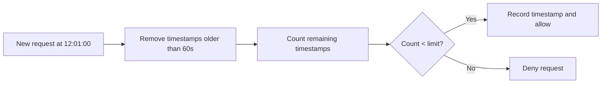
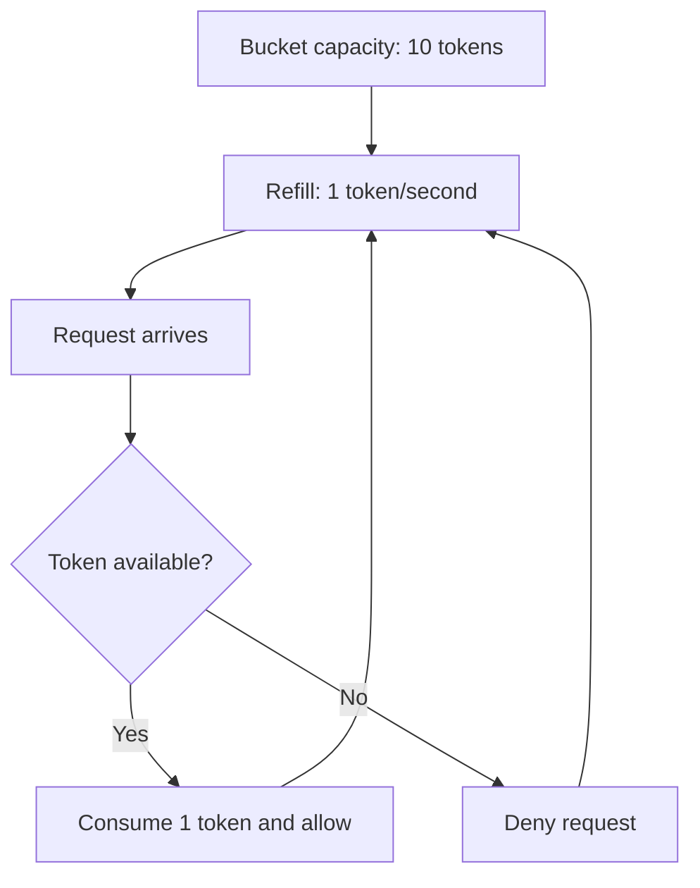

# Limigo

Limigo v0.1: Redis-backed distributed and hot-reloadable rate limiter in Go with configurable rules, fixed/sliding/token-bucket algorithms, Lua atomic operations, HTTP check endpoint, Docker Compose quickstart, tests, and basic Prometheus metrics.

## Rate limiting algorithms

Limigo supports three rate limiting algorithms behind a common interface. They solve the same problem, but with different trade-offs around fairness, burst handling, memory usage, and implementation cost.

### 1. Fixed window counter

Fixed window is the simplest approach: count requests in a fixed time window, then reset the counter when the next window starts.

Real-life example: a free API plan allows 100 requests per minute. If a user sends 100 requests at 12:00:59 and another 100 at 12:01:00, both batches can pass because they land in different minute windows. That means the user effectively sends 200 requests in about one second.

```mermaid
timeline
    title Fixed window boundary burst
    12:00:00 : Window A starts
    12:00:59 : 100 requests allowed
    12:01:00 : Window B starts and counter resets
    12:01:00 : 100 more requests allowed
```

Where it fails: imagine this limit protects a checkout or payment API. A client can spend its full minute quota just before the reset, then immediately spend the next minute's quota right after the reset. Redis sees both batches as valid because the counter changed windows, but the payment service still receives 200 near-simultaneous requests. That can exhaust worker pools, trigger database lock contention, slow down unrelated customers, or make retries pile up even though the client technically stayed under 100 requests in each fixed minute.

Limigo still implements fixed window as a simple baseline and to make this weakness visible, but it is not the algorithm the main system should rely on for production traffic. Because of the boundary-burst problem, Limigo also supports sliding window for stricter fairness and token bucket for controlled bursts with a steady average rate.

### 2. Sliding window log

Sliding window improves fairness by looking back over the last rolling time period instead of using hard reset boundaries. Limigo records request timestamps and removes entries that are older than the configured window.

Real-life example: with a limit of 100 requests per minute, a request at 12:01:00 checks the actual period from 12:00:00 to 12:01:00. If the user already sent 100 requests during that rolling minute, the new request is denied even if the wall-clock minute changed.



Why use it: sliding windows avoid the fixed-window boundary burst and give more accurate rate limiting. The trade-off is higher memory usage because recent request timestamps must be stored.

### 3. Token bucket

Token bucket controls the average request rate while still allowing short, controlled bursts. The bucket refills over time up to a maximum capacity. Each allowed request consumes one token.

Real-life example: a user gets 10 tokens and refills at 1 token per second. If they are idle for a while, the bucket fills back up and they can send a quick burst of 10 requests. After that, they are limited to the refill speed.



Why use it: token bucket is useful when short bursts are acceptable but sustained traffic must stay within a steady rate. It is a good fit for user-facing APIs where occasional spikes should not immediately punish well-behaved clients.
