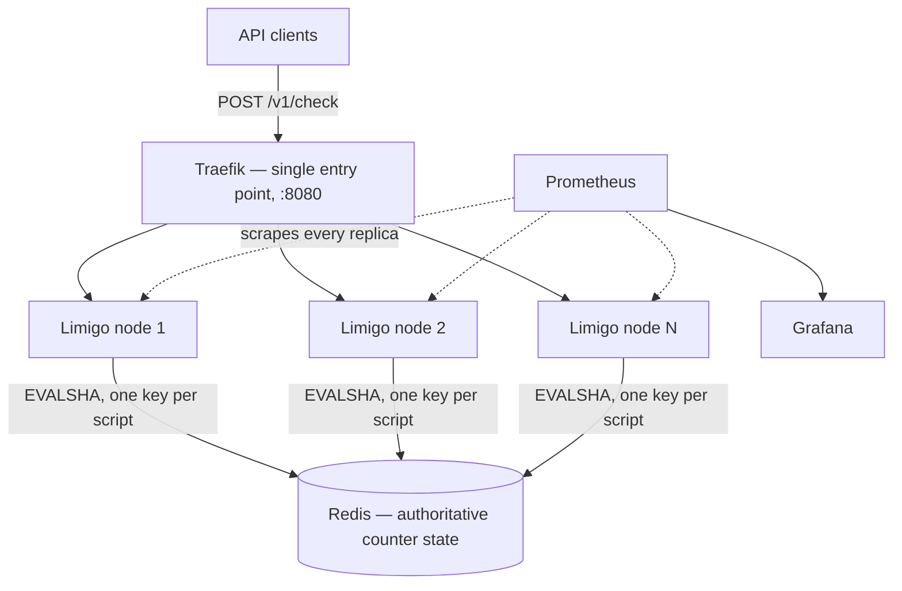
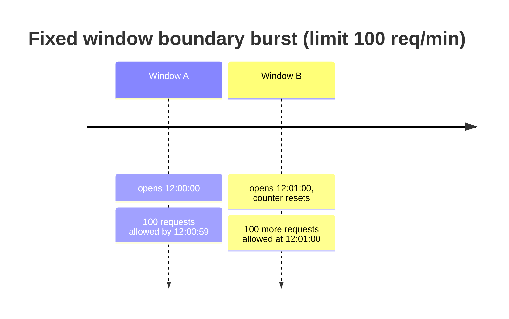
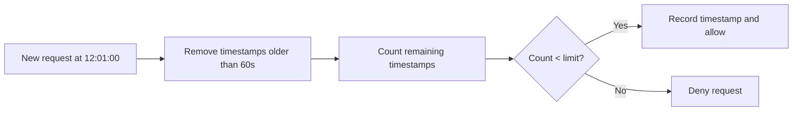
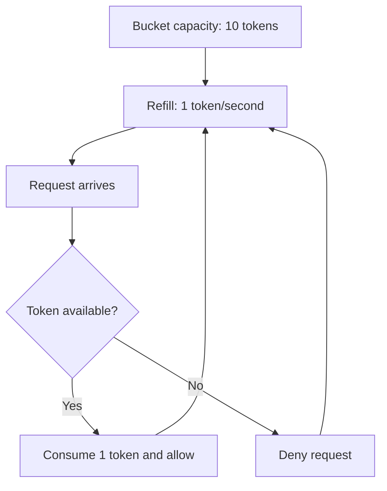
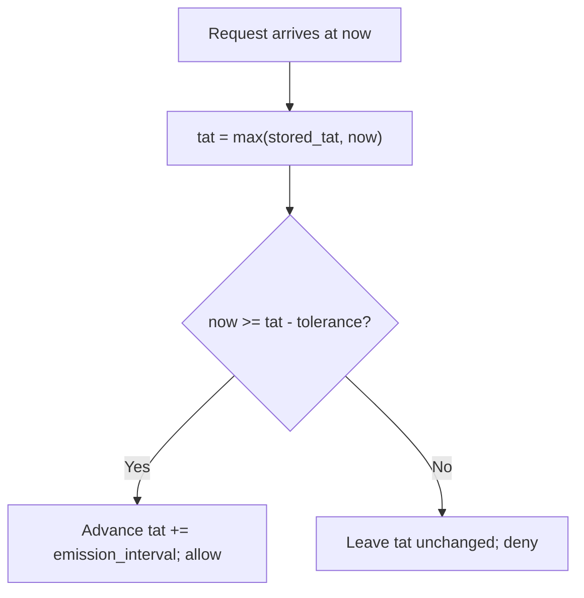
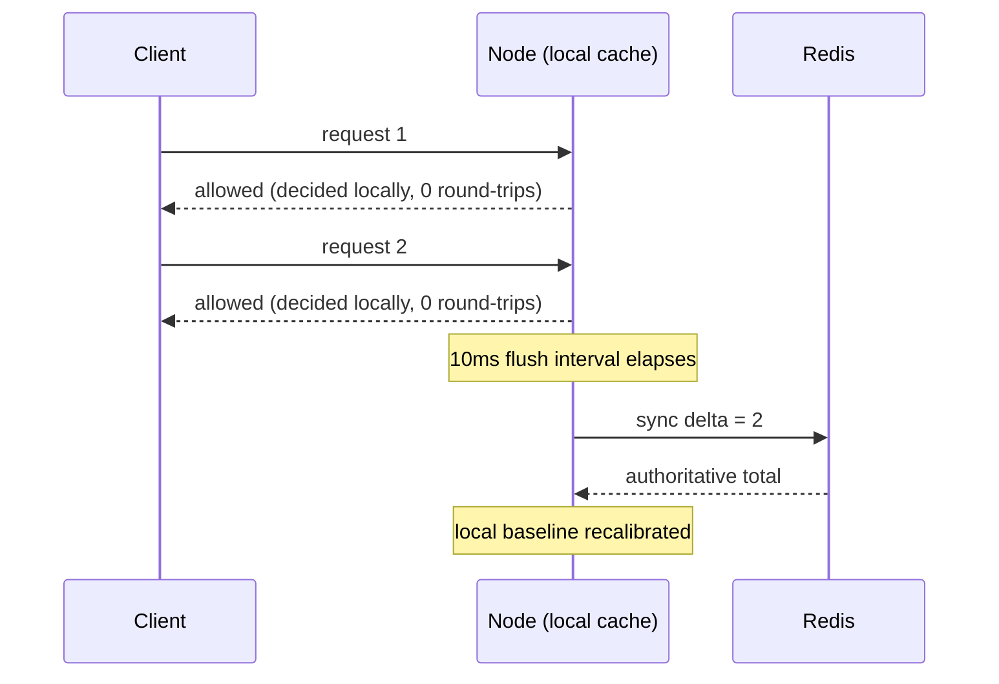

# Limigo

[](https://github.com/HweyTH/limigo/actions/workflows/ci.yml)
[](https://go.dev)
[](https://redis.io)
[](https://www.lua.org)
[](https://traefik.io)
[](https://prometheus.io)
[](https://grafana.com)
[](https://docs.docker.com/compose/)
[](LICENSE)

A distributed rate limiter in Go. Counter state is shared across nodes in Redis
and every decision runs as an atomic Lua script, so adding nodes never
double-spends a client's quota. Four algorithms, hot-reloadable rules, and a
published measurement of exactly what the accuracy/latency trade-off costs.

## Why distributed rate limiting is hard

On one machine, a rate limiter is a counter behind a mutex. All of the difficulty
arrives the moment "one machine" stops being true.

**Race conditions.** The obvious implementation — read the counter, compare it to
the limit, write it back — is a read-modify-write with a gap in the middle. Two
nodes serving the same client can both read `99`, both conclude the request is
under a limit of 100, and both write `100`. The limit is breached and no node did
anything wrong. Limigo never issues a `GET` followed by a `SET`: each algorithm's
entire decision lives in a Lua script under
[`internal/store/lua/`](internal/store/lua/), which Redis executes atomically as a
single unit. Concurrent nodes serialise on the server, so the check and the
increment cannot be interleaved.

**Clock skew.** Anything time-based — a window boundary, a bucket refill, a GCRA
schedule — needs a clock, and separate machines do not agree on what time it is.
A node whose clock runs a second fast expands its own window and admits traffic
its peers would deny. Limigo's scripts never accept a timestamp from the caller;
they call `redis.call('TIME')` and read the clock of the one machine every node
already shares. There is exactly one clock in the system, so there is no skew to
reconcile.

**Redis failover.** The shared state is also a shared dependency. When Redis is
unreachable, a rate limiter has to choose: admit traffic it can no longer meter,
or deny traffic it can no longer justify denying. Limigo currently **fails
closed** — `/v1/check` returns `503` with `allowed: false`, and the error is
counted separately from a genuine denial so the two are never confused on a
dashboard. That protects the quota at the cost of availability, which is the
less common choice and the right one only for some deployments. It is deliberate
but not yet defended in writing or measured under a real outage; that work is
tracked in [#4](https://github.com/HweyTH/limigo/issues/4).

## Architecture

Limigo nodes are stateless and interchangeable. All shared counter state lives in
Redis, so a node holds nothing that matters if it dies — which is what makes
`docker compose up --scale limigo=3` a meaningful thing to do rather than three
independent limiters disagreeing with each other.



Rules are matched in configuration order, first match wins, and the whole rule
set is recompiled and swapped atomically when the config file changes on disk —
no restart, no dropped requests.

## Rate limiting algorithms

Limigo supports four rate limiting algorithms behind a common interface. They solve the same problem, but with different trade-offs around fairness, burst handling, memory usage, and implementation cost.

| Algorithm | Accuracy | Burst behaviour | State per key | `local_cache` | Exact `Retry-After` |
|---|---|---|---|---|---|
| **Fixed window counter** | Approximate — boundary bursts | Up to 2× the limit across a window edge | One integer | Supported | No |
| **Sliding window log** | Exact over the rolling window | None | One timestamp per request in the window | Rejected at config validation | No |
| **Token bucket** | Exact average rate | Up to the bucket's capacity | Two fields: tokens, last refill | Supported | No |
| **Leaky bucket (GCRA)** | Exact schedule | Configurable tolerance via `burst` | One timestamp (the TAT) | Rejected at config validation | Yes — millisecond precision |

The last two columns are facts about *this* implementation rather than about the
algorithms in general, and both are enforced in code: `local_cache` is rejected
at config-validation time for the two algorithms whose guarantees it would
undermine, and only GCRA can compute the exact moment a denied client becomes
admissible. Both are explained below.

### 1. Fixed window counter

Fixed window is the simplest approach: count requests in a fixed time window, then reset the counter when the next window starts.

Real-life example: a free API plan allows 100 requests per minute. If a user sends 100 requests at 12:00:59 and another 100 at 12:01:00, both batches can pass because they land in different minute windows. That means the user effectively sends 200 requests in about one second.



Where it fails: imagine this limit protects a checkout or payment API. A client can spend its full minute quota just before the reset, then immediately spend the next minute's quota right after the reset. Redis sees both batches as valid because the counter changed windows, but the payment service still receives 200 near-simultaneous requests. That can exhaust worker pools, trigger database lock contention, slow down unrelated customers, or make retries pile up even though the client technically stayed under 100 requests in each fixed minute.

Limigo still implements fixed window as a simple baseline and to make this weakness visible, but it is not the algorithm the main system should rely on for production traffic. Because of the boundary-burst problem, Limigo also supports sliding window for stricter fairness and token bucket for controlled bursts with a steady average rate.

### 2. Sliding window log

Sliding window improves fairness by looking back over the last rolling time period instead of using hard reset boundaries. Limigo records request timestamps and removes entries that are older than the configured window.

Real-life example: with a limit of 100 requests per minute, a request at 12:01:00 checks the actual period from 12:00:00 to 12:01:00. If the user already sent 100 requests during that rolling minute, the new request is denied even if the wall-clock minute changed.



Why use it: sliding windows avoid the fixed-window boundary burst and give more accurate rate limiting. The trade-off is higher memory usage because recent request timestamps must be stored.

### 3. Token bucket

Token bucket controls the average request rate while still allowing short, controlled bursts. The bucket refills over time up to a maximum capacity. Each allowed request consumes one token.

Real-life example: a user gets 10 tokens and refills at 1 token per second. If they are idle for a while, the bucket fills back up and they can send a quick burst of 10 requests. After that, they are limited to the refill speed.



Why use it: token bucket is useful when short bursts are acceptable but sustained traffic must stay within a steady rate. It is a good fit for user-facing APIs where occasional spikes should not immediately punish well-behaved clients.

### 4. Leaky bucket (GCRA)

Leaky bucket admits requests on a steady schedule instead of allowing bursts up to a capacity. Limigo implements it as **GCRA** (Generic Cell Rate Algorithm) — the form used in production by Stripe's rate limiter and Redis's `redis-cell` module — which tracks a single value per key: the Theoretical Arrival Time (TAT), the earliest moment the next request is due under perfectly smooth spacing. A request is admitted if it arrives no earlier than a configured tolerance before its TAT; admitting one advances the TAT by one emission interval (`window / limit`), while a denied request leaves the schedule untouched.

Real-life example: a downstream payment processor can sustain 10 requests/second without degrading, and does not benefit from bursty traffic the way an API gateway might. A `leaky_bucket` rule with `limit: 10, window: 1s, burst: 1` smooths a client's requests to one every 100ms, rejecting anything arriving faster — no boundary bursts, no capacity to bank up and spend all at once.



Why use it: leaky bucket is the right choice when downstream capacity is fixed and predictable — the goal is a smooth, steady output rate rather than accommodating bursts. Because local burst-absorption would undermine that guarantee, `leaky_bucket` rules do not support `local_cache` (see below) — every request is checked against the authoritative GCRA schedule in Redis.

**Exact retry timing:** unlike the other three algorithms, GCRA already knows precisely how long a denied client must wait — `allow_at - now` — so Limigo surfaces it instead of discarding it. A denied `/v1/check` response for a leaky bucket rule includes `retry_after_ms` in the JSON body (millisecond precision) and a standard `Retry-After` header (seconds, rounded up) for HTTP-conventional clients and proxies. This turns "you're rate limited" into "you're rate limited, try again in exactly N ms" — the point of choosing a smoothing algorithm in the first place.

## Design decisions

### Node-local caching (`local_cache`)

By default, every request triggers one Redis round-trip: a Lua script runs atomically on the Redis server, checks the limit, and returns an allow/deny decision. This is the correct, fully-accurate approach, but it means Redis load and network latency both scale linearly with request volume — at high sustained throughput, that per-request round-trip becomes the bottleneck.

Setting `local_cache: true` on a rule opts it into a different model: each node keeps a small in-process cache that absorbs bursts locally and decides allow/deny with **zero network round-trip**, then periodically (every `--cache-flush-interval`, default 10ms) reconciles its local tally with Redis's authoritative count in one batched call instead of one call per request.

```yaml
rules:
  - name: free-tier-fixed-window
    match:
      header: X-Plan
      value: free
    algorithm: fixed_window
    local_cache: true      # opt-in: absorb bursts locally, sync every --cache-flush-interval
    fixed_window:
      limit: 100
      window: 60s
```



**Why only `fixed_window` and `token_bucket` support this, and `sliding_window` deliberately does not:** sliding window's entire value proposition, documented above, is exact rolling-window accuracy with no boundary bursts. Batching it would mean trading away the one thing it exists to guarantee, for a latency win nobody asked that specific algorithm to make. `fixed_window` and `token_bucket` are both just counters/bucket state, which batch cleanly as a delta; sliding window would require batching sets of individual timestamps, which is both architecturally messier and directly undermines its documented purpose. `local_cache: true` is rejected at config-validation time for both `sliding_window` and `leaky_bucket` rules — for `leaky_bucket`, because local burst absorption is precisely what a smoothing algorithm exists to prevent.

**The accuracy trade-off, quantified:** during the interval between flushes, each node's admit decisions are based on the last value it heard from Redis, not the fleet-wide truth at that instant. The maximum possible over-admission in any single flush interval is bounded by `(number of nodes) × (max requests one node can locally admit within that interval)` — a small, quantifiable slip, not an unbounded bypass. Crucially, it does not accumulate: every flush interval reconciles back to the true total, so the next interval starts from a corrected baseline rather than compounding drift.

**This makes `local_cache` a fairness/throughput knob, not a security boundary.** It is a good fit for a free-tier or cost-control limit, where a brief, bounded overshoot is an acceptable trade for reduced Redis load. It is **not** recommended for a rule that functions as an abuse or security boundary (e.g. login attempts, payment endpoints) — those should stay on the default synchronous path, where every decision is exact.

**Interaction with config hot-reload:** Limigo watches its config file and rebuilds the rule engine on every change, without a restart. Because each rebuilt engine has its own local caches, a naive reload would discard any not-yet-flushed local admits when the old engine is replaced. Limigo flushes the outgoing engine's local caches to Redis immediately before swapping in the new one, so a reload never silently drops pending admits — the only remaining accuracy window is the same bounded, self-correcting one described above.

## Benchmarks

All numbers below were measured on this project's own hardware and are reported
as a cost relative to a measured ceiling, never as a bare absolute — a limiter
throughput figure alone can't tell you whether the limiter is slow or the
environment is saturated. Methodology and the reasoning behind each measurement
choice are stated alongside each table below; raw per-run output lives in
[`bench/results/`](bench/results/).

**No table here reports throughput and latency from the same run**, and that is
worth a paragraph because it is the single easiest way to publish a rate limiter
benchmark that is quietly wrong.

Throughput rows are closed-loop: a fixed pool of workers, each sending a request
and waiting for the response before sending the next. That measures maximum
sustainable req/s correctly and measures latency badly. When the service stalls,
every worker is parked waiting, so the requests that were due during the stall
are never sent and never timed — the worst moments delete their own evidence,
and the reported p99 *improves* because things got worse. Gil Tene named this
**coordinated omission**. `vegeta` is normally resistant to it (it timestamps at
actual send time and grows its worker pool to catch up), but the fixed
`-max-workers` cap this harness used removed exactly the pool growth that
resistance depends on.

So every latency figure below comes from a separate **open-model** run: a fixed
arrival rate of **10,761 req/s** — 70% of the measured ceiling, leaving headroom
to catch up — with **no worker cap**, so the generator keeps its schedule
through a stall instead of coordinating with it. Each latency table prints the
offered rate beside the attained rate: if those diverge, the percentiles beside
them describe a saturated generator rather than the service.

### 1. Control rows — the ceiling

`GET /healthz` touches no rule logic; load-testing it establishes what the
environment itself can do before any of Limigo's own cost is added.

| row | req/s | success |
|---|---|---|
| direct-to-replica, in-network | 17,916 | 100% |
| **through-Traefik, in-network (ceiling used below)** | **15,374** | 100% |
| host-origin (crosses the Docker Desktop VM boundary) | 31,749 | 100% |

Host-origin reaches roughly double the in-network rate. The likely reason is
that the generator running outside the container is not competing for the four
cores the in-network generator is pinned to — a less constrained measuring
instrument rather than a faster system. That reading is not proven by anything
in this table: it was previously supported by host-origin's ~10× worse p99, and
the open-model latency run was only done for the through-Traefik path, so no
published figure backs it now.

The reason for not using host-origin as the ceiling does not depend on that
reading. It crosses the Docker Desktop VM boundary, which no in-network row
crosses, so it does not characterise the same path. Everything below uses the
through-Traefik, in-network ceiling, since the algorithm and node axes run
in-network through Traefik too.

The same control path, measured open-model for its latency:

| row | offered req/s | attained req/s | p50 (ms) | p95 (ms) | p99 (ms) | max (ms) |
|---|---|---|---|---|---|---|
| through-Traefik, in-network | 10,761 | 10,761 | 0.19 | 0.47 | 1.20 | 13.16 |

### 1b. The other bound — what Redis alone can do

The control rows bound the *transport*. This bounds the other end: what Redis
can do with Limigo's own `token_bucket.lua`, driven by `redis-benchmark`, with
no Go, no HTTP and no JSON in the path. Every uncached request must wait for
exactly this script, so no uncached row below can exceed it.

| bound | req/s | p99 (ms) |
|---|---|---|
| `redis-benchmark evalsha` (`token_bucket.lua`) | 89,127 | 1.04 |

The script is `SCRIPT LOAD`ed from the same file `internal/store/lua` embeds, so
the SHA benchmarked is the SHA Limigo runs; `-r 10000` matches the 10k-key
cardinality of the axes below, and `-P 1` leaves pipelining off because Limigo
issues one `EVALSHA` per request and does not pipeline.

**This is the number that reframes everything below it.** Limigo's best uncached
allow-path row is 13,811 req/s — about **15% of what Redis served for this
script**. §4 uses that to argue Redis is not the obvious constraint here.

Two caveats travel with the row and are not dropped when it is cited.
`redis-benchmark` drives its own 50 connections rather than replaying Limigo's
concurrency pattern, and it ran **while Limigo was idle** — so 89,127 is an
upper bound on the Redis leg under that tool's load, not a measurement of how
much headroom remains while Limigo is actually working. It is also co-resident
with Redis in the same Docker VM as everything else here. It bounds Redis on
this box, and says nothing about Redis in general.

### 2. Overshoot / consistency — the headline result

The [local-cache accuracy trade-off](#node-local-caching-local_cache) is a
measured, bounded quantity here, not an assertion. `burst-tier-token-bucket`
(no cache) vs `cached-tier-token-bucket` (`local_cache: true`, identical
capacity/rate) — each fired exactly 4,000 requests at a single key over 2s
against a fresh Redis, at 1, 2, and 3 replicas. Expected ceiling (capacity +
rate × seconds) = 1,400 admits.

| nodes | arm | admitted | expected ceiling | overshoot |
|---|---|---|---|---|
| 1 | `local_cache: false` | 1,399 | 1,400 | -0.07% |
| 2 | `local_cache: false` | 1,399 | 1,400 | -0.07% |
| 3 | `local_cache: false` | 1,399 | 1,400 | -0.07% |
| 1 | `local_cache: true` | 1,395 | 1,400 | -0.36% |
| 2 | `local_cache: true` | 1,398 | 1,400 | -0.14% |
| 3 | `local_cache: true` | 1,401 | 1,400 | +0.07% |

`local_cache: false` sits at ~0% overshoot at every node count — Lua atomicity
holds under genuine cross-node concurrency. `local_cache: true` deviates by at
most **0.36%** of the configured limit across 1–3 nodes, with no unbounded or
accelerating growth. The full run, plus the accuracy/latency sweep across
`--cache-flush-interval` values from 1ms to 1000ms, is at
[`bench/results/2026-08-23-220502-Thais-MacBook-Air-3-overshoot.md`](bench/results/2026-08-23-220502-Thais-MacBook-Air-3-overshoot.md)
and
[`bench/results/2026-08-23-223052-Thais-MacBook-Air-3-flush-sweep.md`](bench/results/2026-08-23-223052-Thais-MacBook-Air-3-flush-sweep.md).

### 3. Scaling curve — throughput at 1, 2, 3 nodes

`token_bucket`, 10k keys, allow path, through Traefik. Cost is reported against
the single-replica through-Traefik ceiling above.

| nodes | req/s | cost vs ceiling |
|---|---|---|
| 1 | 12,367 | 80.4% of ceiling |
| 2 | 13,147 | 85.5% of ceiling |
| 3 | 12,765 | 83.0% of ceiling |

This is flat and non-monotonic — adding replicas did **not** increase throughput
on this hardware, and the spread between these three rows is smaller than the
run-to-run variance of the measurement itself (the single-replica `token_bucket`
row in §4, same configuration, came in at 13,811 in the same suite).

The bottleneck is named rather than hidden: every row above is generated by one
in-network vegeta container, CPU-pinned to half of an 8-core Apple M2, and it
saturates at essentially the same rate regardless of how many Limigo replicas
sit behind Traefik. §1b rules out the other candidate — Redis is serving these
runs at about 15% of its measured capacity for this script, so it is not what
these replicas are queuing behind.

What this table supports is therefore a narrower claim than "throughput scales
with node count", and the narrower claim is the one made here: across 1–3
replicas, correctness holds (§2) and per-request cost does not degrade — adding
nodes does not make the system slower or less correct under the load this
generator can produce. Confirming throughput scaling would need load generated
from more than one physical machine, which this hardware cannot provide;
[issue #5](https://github.com/HweyTH/limigo/issues/5) tracks closing that gap
honestly rather than re-running this table hoping for a different shape.

### 4. Algorithm comparison — uncached, 10k keys, in-network

All four algorithms, allow path, 1 replica, headroom limits so the allow path
stays hot (`bench/config.loadtest.yaml`).

| algorithm | req/s | cost vs ceiling |
|---|---|---|
| fixed_window | 13,534 | 88.0% of ceiling |
| sliding_window | 13,647 | 88.8% of ceiling |
| token_bucket | 13,811 | 89.8% of ceiling |
| leaky_bucket | 12,573 | 81.8% of ceiling |

And their latency, measured open-model at 10,761 req/s. The control row for this
table is §1's open-model control (p50 0.19, p99 1.20 at the same offered rate) —
the same path with no rule logic, so each row below reads as rule-evaluation cost
added to it:

| algorithm | p50 (ms) | p95 (ms) | p99 (ms) | max (ms) |
|---|---|---|---|---|
| fixed_window | 0.30 | 0.77 | 1.92 | 23.79 |
| sliding_window | 0.31 | 0.84 | 2.23 | 23.48 |
| token_bucket | 0.33 | 0.84 | 1.86 | 23.64 |
| leaky_bucket | 0.43 | 1.57 | **4.94** | 27.86 |

On throughput the four sit within a few points of each other. On tail latency
they do not: **leaky_bucket's p99 is roughly 2.5× the other three**, a gap that
only appears under open-model measurement. The earlier closed-loop numbers put
leaky_bucket at 1.98ms against 1.67–1.69ms for the others
([2026-08-23 run](bench/results/2026-08-23-230659-Thais-MacBook-Air-3-throughput.md))
— a difference small enough to dismiss as noise. It was not noise; it was
coordinated omission hiding most of it.

**Where the cost actually goes.** The intuitive answer is the Redis round-trip,
and the evidence here does not support it. An isolated `Engine.Check` against
real Redis costs 122.9µs uncached versus 25.18ns cached (§6) — four orders of
magnitude — which makes the round-trip look dominant. But that is *serial
latency*, not a throughput bound. Redis served this script at 89,127 req/s in
§1b, and these rows ask about 13.8k.

The stronger evidence is the control ceiling. The same path with **no rule logic
and no Redis at all** tops out at 15,374 req/s, and `token_bucket` reaches 13,811
of it — so rule matching plus the entire Redis round-trip costs about **10% of a
ceiling set by HTTP, JSON, Traefik and a co-resident load generator**. Whatever
is limiting these runs, most of it is already present when Redis is not.

Two things stop this from being a claim that Redis has 6× headroom in
production. §1b's 89,127 was measured with `redis-benchmark` driving its own 50
connections **while Limigo was idle** — it is an upper bound on the Redis leg
under that tool's load, not a measurement of headroom remaining while Limigo is
working, and it is co-resident with everything else in the same Docker VM.
Second, this table's own spread argues against a purely transport-bound story:
`leaky_bucket` at 81.8% versus `token_bucket` at 89.8% is an 8-point,
algorithm-attributable gap that a system bound entirely by transport would not
produce.

So the defensible statement is the narrow one: **Redis is not the obvious
constraint on this hardware**, and the missing throughput is mostly accounted
for before Redis enters the picture. On bigger hardware, or with the generator
moved off-box, that balance would shift.

Pick an algorithm for its accuracy and fairness properties (above) and, if tail
latency matters to you, note leaky_bucket's p99 — not for throughput, where they
don't meaningfully differ.

### 5. Cached vs uncached — the controlled pair

Same `burst-tier-token-bucket` / `cached-tier-token-bucket` pair as §2, both
held to a fixed 150 req/s (under their shared 200/s refill) so the allow path
stays hot for both arms. At this rate the comparison is latency, not max
throughput. Both arms are open-model, so these percentiles carry the same
guarantee as every other latency table here; §1's open-model control row is the
control for this table as it is for §4.

**This is the latency headline.** It is the one place where a design decision
Limigo made — node-local caching — is isolated against an otherwise identical
rule and its cost measured on both axes at once: the latency it buys here, and
the ≤0.36% accuracy it spends in §2.

| arm | p50 (ms) | p95 (ms) | p99 (ms) | max (ms) |
|---|---|---|---|---|
| uncached | 1.21 | 2.12 | 3.40 | 12.65 |
| cached (`local_cache: true`) | 1.00 | 1.34 | 1.92 | 10.38 |

Skipping the Redis round-trip on the allow path cuts p99 latency by **44%** and
p95 by **37%** — the win `local_cache` is designed to produce, quantified rather
than asserted, and paid for with the ≤0.36% overshoot measured in §2.

### 6. Microbenchmarks — Go, `-count=10`, reduced with benchstat

The inner two layers of the three-layer benchmark story, each run ten
times and reduced by [benchstat](https://pkg.go.dev/golang.org/x/perf/cmd/benchstat)
rather than reported from a single run. The `±` is a 95% confidence interval; on
a thermally-throttled laptop sharing cores with Docker, it is what separates a
measurement from an anecdote.

| benchmark | median | ± |
|---|---|---|
| `EngineCheck_Uncached` (real Redis, full round trip) | 122.9µs | 5% |
| `EngineCheck_Cached` (`local_cache: true`, no round trip) | 25.18ns | 0% |

The pure-algorithm layer, with no store, HTTP, or container in the path — all
twelve rows landed within ±2%:

| algorithm | serial | parallel (1k keys) |
|---|---|---|
| fixed_window | 28.56ns ± 1% | 10.62ns ± 2% |
| sliding_window | 48.86ns ± 1% | 91.31ns ± 1% |
| token_bucket | 77.45ns ± 1% | 89.93ns ± 2% |
| leaky_bucket | 57.69ns ± 1% | 91.88ns ± 1% |
| fixed_window (batched) | 10.71ns ± 1% | 88.00ns ± 2% |
| token_bucket (batched) | 10.70ns ± 0% | 88.98ns ± 2% |

The batched variants are the ones node-local caching uses: ~10.7ns serial
against 28.6–77.5ns for their uncached equivalents.

Five of the six parallel rows land in a tight 88–92ns band, well above their own
serial cost. That band is not the algorithm — it is the manager's per-key
routing lock, which every concurrent caller has to pass through, and it dominates
whatever the algorithm does behind it.

`fixed_window` is the exception that proves it: 10.62ns parallel against 28.56ns
serial, *faster* under concurrency and 8× off the band. It is the one algorithm
with no manager in this codebase — uncached fixed-window rules go straight to
Redis, so its parallel benchmark pre-allocates one instance per key
(`internal/limiter/bench_test.go`). No shared lock to serialise on, so the work
spreads across cores instead of queuing. The contrast is the cleanest evidence
here that the other five rows are measuring the lock rather than the algorithm.

### Hardware and reproduction

All numbers above were measured on:

- Host: `Darwin Thais-MacBook-Air-3.local 25.3.0 Darwin Kernel Version 25.3.0 arm64`
- CPU: Apple M2 (8 logical cores)
- Docker: 27.5.1
- Go: 1.27.0

```bash
bench/run-throughput.sh   # §1, §1b, §3, §4, §5: control rows, Redis bound, algorithm axis, scaling curve, cached-vs-uncached
bench/run-overshoot.sh --requests 4000 --seconds 2 --max-workers 200   # §2: overshoot / consistency
bench/run-flush-sweep.sh  # §2: accuracy/latency sweep across --cache-flush-interval
bench/run-microbench.sh   # §6: Go microbenchmarks at -count=10, reduced with benchstat
```

`bench/run-microbench.sh` needs `benchstat` on `PATH`
(`go install golang.org/x/perf/cmd/benchstat@latest`); pass `--skip-engine` to
run the pure-algorithm layer without Docker.

The full per-run output backing §1, §1b, §3, §4 and §5 is
[`bench/results/2026-08-30-085730-Thais-MacBook-Air-3-throughput.md`](bench/results/2026-08-30-085730-Thais-MacBook-Air-3-throughput.md);
§6 is
[`bench/results/2026-08-30-085312-Thais-MacBook-Air-3-microbench.md`](bench/results/2026-08-30-085312-Thais-MacBook-Air-3-microbench.md).

Raw output for every run above — vegeta binaries, generated targets, decoded
latency samples — is kept under [`bench/results/`](bench/results/) and
`bench/results/raw/` (gitignored; regenerate by rerunning the scripts rather
than diffing binary blobs).

## Installation

### Option A: Docker Compose (fastest way to see it working)

This brings up the full stack — Limigo, Redis, Prometheus, and Grafana, wired together and pre-provisioned — in one command. Requires only [Docker](https://docs.docker.com/get-docker/) with Compose v2.

```bash
git clone https://github.com/HweyTH/limigo.git
cd limigo
docker compose up -d --build
```

Once the containers are healthy:

| Service | URL | Notes |
|---|---|---|
| Limigo API | http://localhost:8080/v1/check | `POST` requests here, routed through Traefik to whichever replica picks it up |
| Prometheus | http://localhost:9090 | discovers and scrapes every Limigo replica every 5s |
| Grafana | http://localhost:3000 | login `admin` / `admin`; the "Limigo" dashboard is pre-loaded |

Limigo itself binds no fixed host ports — Traefik is the only entry point, so
the API stays reachable at one address no matter how many replicas are
running. Scale it up with:

```bash
docker compose up -d --scale limigo=3
```

Individual replicas and their `/metrics` endpoints aren't published to the
host; reach them from inside the compose network (`docker compose exec` into
another service, or a container on the same network), or read the numbers
back through Grafana.

Try a request against the bundled `config.example.yaml` rules:

```bash
curl -X POST localhost:8080/v1/check \
  -H "X-Plan: free" \
  -H "Content-Type: application/json" \
  -d '{"key":"user-123"}'
```

```json
{"allowed":true,"matched":true,"rule":"free-tier-fixed-window"}
```

Repeat past the rule's limit (100 requests/minute) and the same request returns
`429 Too Many Requests` instead of `200` (fixed window doesn't compute an exact
retry time, so no `Retry-After` header is sent here — see the leaky bucket
section above for a rule that does):

```json
{"allowed":false,"matched":true,"rule":"free-tier-fixed-window"}
```

Tear it down with `docker compose down` (add `-v` to also drop Redis's data volume).

### Option B: Run locally with Go

Requires Go 1.25+ and a running Redis instance.

```bash
# 1. Start Redis (skip if you already have one)
docker run -d --name limigo-redis -p 6379:6379 redis:7-alpine

# 2. Clone and build
git clone https://github.com/HweyTH/limigo.git
cd limigo
go build -o limigo ./cmd/limigo

# 3. Run against the example rules
./limigo -config config.example.yaml -redis-addr localhost:6379
```

The server listens on `:8080` (API) and `:9091` (Prometheus metrics) by default. Both are configurable via flags or environment variables:

| Flag | Env var | Default | Purpose |
|---|---|---|---|
| `-config` | `LIMIGO_CONFIG` | `config.example.yaml` | path to the rules YAML file |
| `-redis-addr` | `REDIS_ADDR` | `localhost:6379` | Redis server address |
| `-http-addr` | `LIMIGO_HTTP_ADDR` | `:8080` | API listen address |
| `-metrics-addr` | `LIMIGO_METRICS_ADDR` | `:9091` | Prometheus `/metrics` listen address; set empty to disable |
| `-shutdown-timeout` | `LIMIGO_SHUTDOWN_TIMEOUT` | `10s` | max time to drain in-flight requests on `SIGTERM` |
| `-cache-flush-interval` | `LIMIGO_CACHE_FLUSH_INTERVAL` | `10ms` | how often `local_cache: true` rules sync to Redis |

Write your own rules by copying `config.example.yaml` — see the [Rule configuration](#node-local-caching-local_cache) examples above for the YAML shape per algorithm. Limigo hot-reloads the file on save, so rule changes take effect without a restart.

### Running the tests

```bash
go test ./...
```

The `internal/store` package spins up a real Redis via [testcontainers](https://golang.testcontainers.org/), so Docker must be running locally for the full suite to pass.

Pass `-short` to skip it and run everything else without Docker:

```bash
go test -short ./...
```

## License

MIT — see [`LICENSE`](LICENSE).
