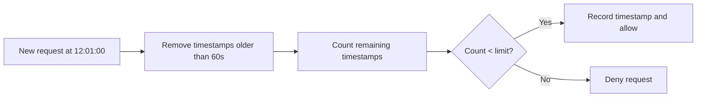
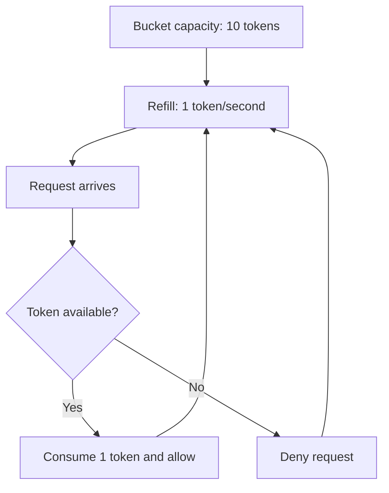
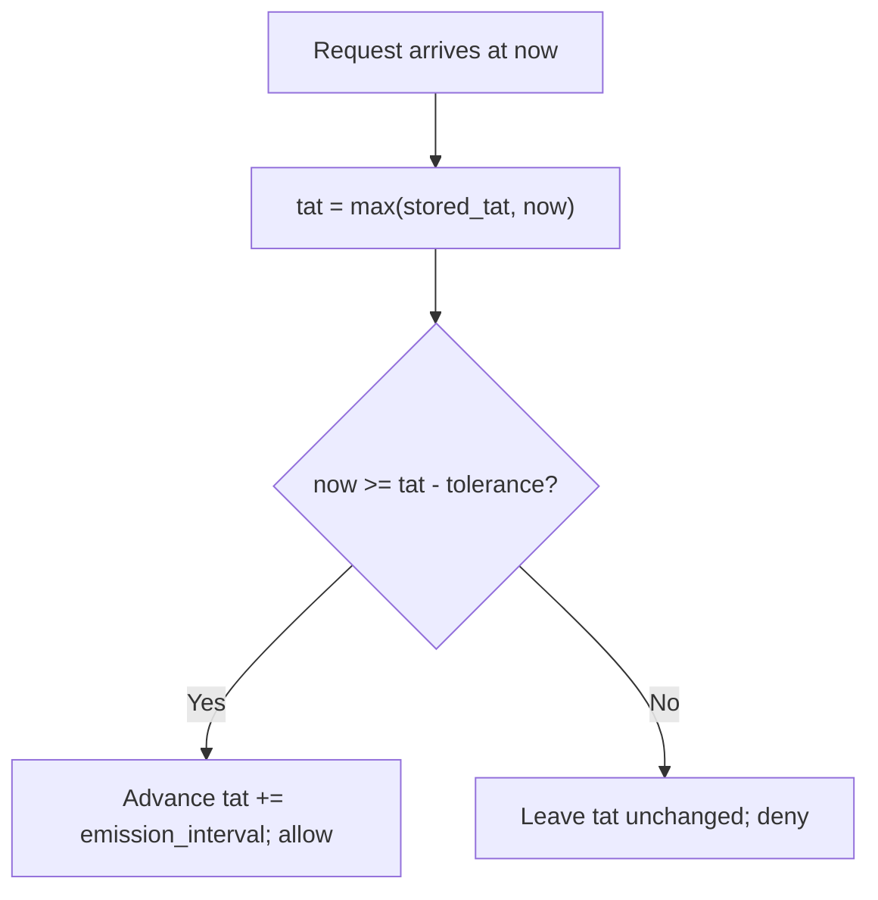
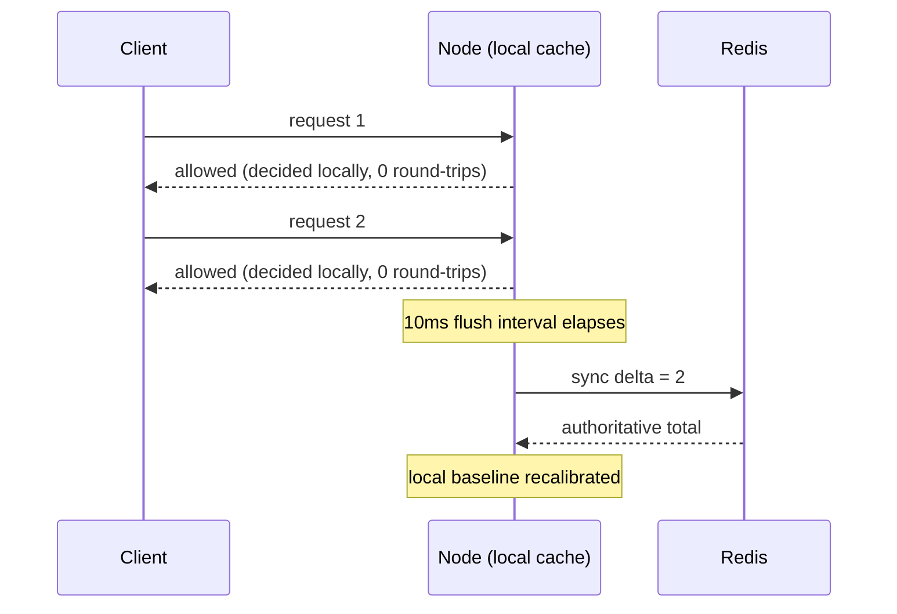

# Limigo

Limigo v0.1: Redis-backed distributed and hot-reloadable rate limiter in Go with configurable rules, fixed/sliding/token-bucket/leaky-bucket algorithms, Lua atomic operations, HTTP check endpoint, Docker Compose quickstart, tests, and basic Prometheus metrics.

## Rate limiting algorithms

Limigo supports four rate limiting algorithms behind a common interface. They solve the same problem, but with different trade-offs around fairness, burst handling, memory usage, and implementation cost.

### 1. Fixed window counter

Fixed window is the simplest approach: count requests in a fixed time window, then reset the counter when the next window starts.

Real-life example: a free API plan allows 100 requests per minute. If a user sends 100 requests at 12:00:59 and another 100 at 12:01:00, both batches can pass because they land in different minute windows. That means the user effectively sends 200 requests in about one second.

```mermaid
timeline
    title Fixed window boundary burst
    12:00:00 : Window A starts
    12:00:59 : 100 requests allowed
    12:01:00 : Window B starts and counter resets
    12:01:00 : 100 more requests allowed
```

Where it fails: imagine this limit protects a checkout or payment API. A client can spend its full minute quota just before the reset, then immediately spend the next minute's quota right after the reset. Redis sees both batches as valid because the counter changed windows, but the payment service still receives 200 near-simultaneous requests. That can exhaust worker pools, trigger database lock contention, slow down unrelated customers, or make retries pile up even though the client technically stayed under 100 requests in each fixed minute.

Limigo still implements fixed window as a simple baseline and to make this weakness visible, but it is not the algorithm the main system should rely on for production traffic. Because of the boundary-burst problem, Limigo also supports sliding window for stricter fairness and token bucket for controlled bursts with a steady average rate.

### 2. Sliding window log

Sliding window improves fairness by looking back over the last rolling time period instead of using hard reset boundaries. Limigo records request timestamps and removes entries that are older than the configured window.

Real-life example: with a limit of 100 requests per minute, a request at 12:01:00 checks the actual period from 12:00:00 to 12:01:00. If the user already sent 100 requests during that rolling minute, the new request is denied even if the wall-clock minute changed.



Why use it: sliding windows avoid the fixed-window boundary burst and give more accurate rate limiting. The trade-off is higher memory usage because recent request timestamps must be stored.

### 3. Token bucket

Token bucket controls the average request rate while still allowing short, controlled bursts. The bucket refills over time up to a maximum capacity. Each allowed request consumes one token.

Real-life example: a user gets 10 tokens and refills at 1 token per second. If they are idle for a while, the bucket fills back up and they can send a quick burst of 10 requests. After that, they are limited to the refill speed.



Why use it: token bucket is useful when short bursts are acceptable but sustained traffic must stay within a steady rate. It is a good fit for user-facing APIs where occasional spikes should not immediately punish well-behaved clients.

### 4. Leaky bucket (GCRA)

Leaky bucket admits requests on a steady schedule instead of allowing bursts up to a capacity. Limigo implements it as **GCRA** (Generic Cell Rate Algorithm) — the form used in production by Stripe's rate limiter and Redis's `redis-cell` module — which tracks a single value per key: the Theoretical Arrival Time (TAT), the earliest moment the next request is due under perfectly smooth spacing. A request is admitted if it arrives no earlier than a configured tolerance before its TAT; admitting one advances the TAT by one emission interval (`window / limit`), while a denied request leaves the schedule untouched.

Real-life example: a downstream payment processor can sustain 10 requests/second without degrading, and does not benefit from bursty traffic the way an API gateway might. A `leaky_bucket` rule with `limit: 10, window: 1s, burst: 1` smooths a client's requests to one every 100ms, rejecting anything arriving faster — no boundary bursts, no capacity to bank up and spend all at once.



Why use it: leaky bucket is the right choice when downstream capacity is fixed and predictable — the goal is a smooth, steady output rate rather than accommodating bursts. Because local burst-absorption would undermine that guarantee, `leaky_bucket` rules do not support `local_cache` (see below) — every request is checked against the authoritative GCRA schedule in Redis.

**Exact retry timing:** unlike the other three algorithms, GCRA already knows precisely how long a denied client must wait — `allow_at - now` — so Limigo surfaces it instead of discarding it. A denied `/v1/check` response for a leaky bucket rule includes `retry_after_ms` in the JSON body (millisecond precision) and a standard `Retry-After` header (seconds, rounded up) for HTTP-conventional clients and proxies. This turns "you're rate limited" into "you're rate limited, try again in exactly N ms" — the point of choosing a smoothing algorithm in the first place.

## Design decisions

### Node-local caching (`local_cache`)

By default, every request triggers one Redis round-trip: a Lua script runs atomically on the Redis server, checks the limit, and returns an allow/deny decision. This is the correct, fully-accurate approach, but it means Redis load and network latency both scale linearly with request volume — at high sustained throughput, that per-request round-trip becomes the bottleneck.

Setting `local_cache: true` on a rule opts it into a different model: each node keeps a small in-process cache that absorbs bursts locally and decides allow/deny with **zero network round-trip**, then periodically (every `--cache-flush-interval`, default 10ms) reconciles its local tally with Redis's authoritative count in one batched call instead of one call per request.

```yaml
rules:
  - name: free-tier-fixed-window
    match:
      header: X-Plan
      value: free
    algorithm: fixed_window
    local_cache: true      # opt-in: absorb bursts locally, sync every --cache-flush-interval
    fixed_window:
      limit: 100
      window: 60s
```



**Why only `fixed_window` and `token_bucket` support this, and `sliding_window` deliberately does not:** sliding window's entire value proposition, documented above, is exact rolling-window accuracy with no boundary bursts. Batching it would mean trading away the one thing it exists to guarantee, for a latency win nobody asked that specific algorithm to make. `fixed_window` and `token_bucket` are both just counters/bucket state, which batch cleanly as a delta; sliding window would require batching sets of individual timestamps, which is both architecturally messier and directly undermines its documented purpose. `local_cache: true` is rejected at config-validation time for `sliding_window` rules.

**The accuracy trade-off, quantified:** during the interval between flushes, each node's admit decisions are based on the last value it heard from Redis, not the fleet-wide truth at that instant. The maximum possible over-admission in any single flush interval is bounded by `(number of nodes) × (max requests one node can locally admit within that interval)` — a small, quantifiable slip, not an unbounded bypass. Crucially, it does not accumulate: every flush interval reconciles back to the true total, so the next interval starts from a corrected baseline rather than compounding drift.

**This makes `local_cache` a fairness/throughput knob, not a security boundary.** It is a good fit for a free-tier or cost-control limit, where a brief, bounded overshoot is an acceptable trade for reduced Redis load. It is **not** recommended for a rule that functions as an abuse or security boundary (e.g. login attempts, payment endpoints) — those should stay on the default synchronous path, where every decision is exact.

**Interaction with config hot-reload:** Limigo watches its config file and rebuilds the rule engine on every change, without a restart. Because each rebuilt engine has its own local caches, a naive reload would discard any not-yet-flushed local admits when the old engine is replaced. Limigo flushes the outgoing engine's local caches to Redis immediately before swapping in the new one, so a reload never silently drops pending admits — the only remaining accuracy window is the same bounded, self-correcting one described above.

## Benchmarks

All numbers below were measured on this project's own hardware and are reported
as a cost relative to a measured ceiling, never as a bare absolute — a limiter
throughput figure alone can't tell you whether the limiter is slow or the
environment is saturated. Methodology and the reasoning behind each measurement
choice live in [`docs/adr/`](docs/adr/); raw per-run output lives in
[`bench/results/`](bench/results/).

### 1. Control rows — the ceiling (ADR-0004)

`GET /healthz` touches no rule logic; load-testing it establishes what the
environment itself can do before any of Limigo's own cost is added.

| row | req/s | success | p50 (ms) | p99 (ms) |
|---|---|---|---|---|
| direct-to-replica, in-network | 18,517 | 100% | 0.09 | 1.64 |
| **through-Traefik, in-network (ceiling used below)** | **15,852** | 100% | 0.27 | 1.92 |
| host-origin (crosses the Docker Desktop VM boundary) | 31,503 | 100% | 5.62 | 17.44 |

Host-origin shows a higher req/s than either in-network row, but at roughly 10x
the p99 latency — the generator running outside the container is less
CPU-constrained, not the system being faster. The numbers below use the
through-Traefik, in-network ceiling, since the algorithm and node axes also
run in-network through Traefik.

### 2. Overshoot / consistency — the headline result (ADR-0005)

The [local-cache accuracy trade-off](#node-local-caching-local_cache) is a
measured, bounded quantity here, not an assertion. `burst-tier-token-bucket`
(no cache) vs `cached-tier-token-bucket` (`local_cache: true`, identical
capacity/rate) — each fired exactly 4,000 requests at a single key over 2s
against a fresh Redis, at 1, 2, and 3 replicas. Expected ceiling (capacity +
rate × seconds) = 1,400 admits.

| nodes | arm | admitted | expected ceiling | overshoot |
|---|---|---|---|---|
| 1 | `local_cache: false` | 1,399 | 1,400 | -0.07% |
| 2 | `local_cache: false` | 1,399 | 1,400 | -0.07% |
| 3 | `local_cache: false` | 1,399 | 1,400 | -0.07% |
| 1 | `local_cache: true` | 1,395 | 1,400 | -0.36% |
| 2 | `local_cache: true` | 1,398 | 1,400 | -0.14% |
| 3 | `local_cache: true` | 1,401 | 1,400 | +0.07% |

`local_cache: false` sits at ~0% overshoot at every node count — Lua atomicity
holds under genuine cross-node concurrency. `local_cache: true` deviates by at
most **0.36%** of the configured limit across 1–3 nodes, with no unbounded or
accelerating growth. The full run, plus the accuracy/latency sweep across
`--cache-flush-interval` values from 1ms to 1000ms, is at
[`bench/results/2026-08-23-220502-Thais-MacBook-Air-3-overshoot.md`](bench/results/2026-08-23-220502-Thais-MacBook-Air-3-overshoot.md)
and
[`bench/results/2026-08-23-223052-Thais-MacBook-Air-3-flush-sweep.md`](bench/results/2026-08-23-223052-Thais-MacBook-Air-3-flush-sweep.md).

### 3. Scaling curve — throughput at 1, 2, 3 nodes (ADR-0002)

`token_bucket`, 10k keys, allow path, through Traefik. Cost is reported against
the single-replica through-Traefik ceiling above.

| nodes | req/s | cost vs ceiling |
|---|---|---|
| 1 | 13,400 | 84.5% of ceiling |
| 2 | 13,219 | 83.4% of ceiling |
| 3 | 12,853 | 81.1% of ceiling |

This is flat, not linear — adding replicas did **not** increase throughput on
this hardware. The bottleneck is named rather than hidden: every row above is
generated by one in-network vegeta container, CPU-pinned to half of an 8-core
Apple M2 (see control rows), and it saturates at essentially the same rate
regardless of how many Limigo replicas sit behind Traefik. What this table
actually supports is a narrower claim than "throughput scales with node
count": across 1–3 replicas, correctness holds (§2 above) and per-request cost
does not degrade — adding nodes doesn't make the system slower under the load
this generator can produce. Confirming throughput scaling would need a
distributed load generator, which is out of scope here.

### 4. Algorithm comparison — uncached, 10k keys, in-network

All four algorithms, allow path, 1 replica, headroom limits so the allow path
stays hot (`bench/config.loadtest.yaml`).

| algorithm | req/s | p99 (ms) | cost vs ceiling |
|---|---|---|---|
| fixed_window | 13,725 | 1.67 | 86.6% of ceiling |
| sliding_window | 13,409 | 1.69 | 84.6% of ceiling |
| token_bucket | 13,494 | 1.68 | 85.1% of ceiling |
| leaky_bucket | 13,561 | 1.98 | 85.5% of ceiling |

The four algorithms cost within a couple of points of each other. The
dominant cost at this cardinality is the Redis round-trip every uncached rule
pays: an isolated `Engine.Check` against real Redis costs ~119µs uncached
versus ~25ns when `local_cache: true` skips the round-trip entirely
(`internal/rules/engine_bench_test.go`) — four orders of magnitude, dwarfing
any difference between algorithms. Pick an algorithm for its accuracy/fairness
properties (above), not its throughput; they don't meaningfully differ on that
axis.

### 5. Cached vs uncached — the controlled pair

Same `burst-tier-token-bucket` / `cached-tier-token-bucket` pair as §2, both
held to a fixed 150 req/s (under their shared 200/s refill) so the allow path
stays hot for both arms. At this rate the comparison is latency, not max
throughput.

| arm | p50 (ms) | p99 (ms) | max (ms) |
|---|---|---|---|
| uncached | 1.30 | 2.79 | 14.54 |
| cached (`local_cache: true`) | 1.00 | 2.00 | 6.60 |

Skipping the Redis round-trip on the allow path cuts p99 latency by ~28% and
tail (max) latency by more than half — the win `local_cache` is designed to
produce, quantified rather than asserted.

### Hardware and reproduction

All numbers above were measured on:

- Host: `Darwin Thais-MacBook-Air-3.local 25.3.0 Darwin Kernel Version 25.3.0 arm64`
- CPU: Apple M2 (8 logical cores)
- Docker: 27.5.1

```bash
bench/run-throughput.sh   # §1, §3, §4, §5: control rows, algorithm axis, scaling curve, cached-vs-uncached
bench/run-overshoot.sh --requests 4000 --seconds 2 --max-workers 200   # §2: overshoot / consistency
bench/run-flush-sweep.sh  # §2: accuracy/latency sweep across --cache-flush-interval
```

Raw output for every run above — vegeta binaries, generated targets, decoded
latency samples — is kept under [`bench/results/`](bench/results/) and
`bench/results/raw/` (gitignored; regenerate by rerunning the scripts rather
than diffing binary blobs). Design rationale for each methodology choice is in
[`docs/adr/`](docs/adr/).

## Installation

### Option A: Docker Compose (fastest way to see it working)

This brings up the full stack — Limigo, Redis, Prometheus, and Grafana, wired together and pre-provisioned — in one command. Requires only [Docker](https://docs.docker.com/get-docker/) with Compose v2.

```bash
git clone https://github.com/HweyTH/limigo.git
cd limigo
docker compose up -d --build
```

Once the containers are healthy:

| Service | URL | Notes |
|---|---|---|
| Limigo API | http://localhost:8080/v1/check | `POST` requests here, routed through Traefik to whichever replica picks it up |
| Prometheus | http://localhost:9090 | discovers and scrapes every Limigo replica every 5s |
| Grafana | http://localhost:3000 | login `admin` / `admin`; the "Limigo" dashboard is pre-loaded |

Limigo itself binds no fixed host ports — Traefik is the only entry point, so
the API stays reachable at one address no matter how many replicas are
running. Scale it up with:

```bash
docker compose up -d --scale limigo=3
```

Individual replicas and their `/metrics` endpoints aren't published to the
host; reach them from inside the compose network (`docker compose exec` into
another service, or a container on the same network), or read the numbers
back through Grafana.

Try a request against the bundled `config.example.yaml` rules:

```bash
curl -X POST localhost:8080/v1/check \
  -H "X-Plan: free" \
  -H "Content-Type: application/json" \
  -d '{"key":"user-123"}'
```

```json
{"allowed":true,"matched":true,"rule":"free-tier-fixed-window"}
```

Repeat past the rule's limit (100 requests/minute) and the same request returns
`429 Too Many Requests` instead of `200` (fixed window doesn't compute an exact
retry time, so no `Retry-After` header is sent here — see the leaky bucket
section above for a rule that does):

```json
{"allowed":false,"matched":true,"rule":"free-tier-fixed-window"}
```

Tear it down with `docker compose down` (add `-v` to also drop Redis's data volume).

### Option B: Run locally with Go

Requires Go 1.25+ and a running Redis instance.

```bash
# 1. Start Redis (skip if you already have one)
docker run -d --name limigo-redis -p 6379:6379 redis:7-alpine

# 2. Clone and build
git clone https://github.com/HweyTH/limigo.git
cd limigo
go build -o limigo ./cmd/limigo

# 3. Run against the example rules
./limigo -config config.example.yaml -redis-addr localhost:6379
```

The server listens on `:8080` (API) and `:9091` (Prometheus metrics) by default. Both are configurable via flags or environment variables:

| Flag | Env var | Default | Purpose |
|---|---|---|---|
| `-config` | `LIMIGO_CONFIG` | `config.example.yaml` | path to the rules YAML file |
| `-redis-addr` | `REDIS_ADDR` | `localhost:6379` | Redis server address |
| `-http-addr` | `LIMIGO_HTTP_ADDR` | `:8080` | API listen address |
| `-metrics-addr` | `LIMIGO_METRICS_ADDR` | `:9091` | Prometheus `/metrics` listen address; set empty to disable |
| `-shutdown-timeout` | `LIMIGO_SHUTDOWN_TIMEOUT` | `10s` | max time to drain in-flight requests on `SIGTERM` |
| `-cache-flush-interval` | `LIMIGO_CACHE_FLUSH_INTERVAL` | `10ms` | how often `local_cache: true` rules sync to Redis |

Write your own rules by copying `config.example.yaml` — see the [Rule configuration](#node-local-caching-local_cache) examples above for the YAML shape per algorithm. Limigo hot-reloads the file on save, so rule changes take effect without a restart.

### Running the tests

```bash
go test ./...
```

The `internal/store` package spins up a real Redis via [testcontainers](https://golang.testcontainers.org/), so Docker must be running locally for the full suite to pass.
